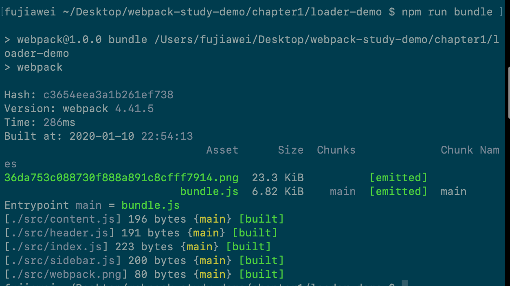

# 配置 loader

## 从打包图片说起

我们前面说过 webpack 可以打包除了 js 意外的其他文件，比如 图片文件，css文件等，那么我们就来试一下，我们在上节课的代码中  `src` 目录下面加上 一张 图片 `webpack.png`，然后在 index.js 中引入：

```js
import webpackSrc from './webpack.png';
```

然后运行 `npm run bundle`。发现打包出错了，如下图：


为什么会出现这个问题，是因为 webpack 默认是知道怎么打包 js 文件的，但是碰到其他类型的文件的时候，webpack 就不知道怎么进行打包了，因此我们需要在配置文件里面告诉 webpack 对于此类文件**模块**需要怎么进行打包。

于是我们在 `webpack.config.js` 中进行如下配置，添加一个module 配置项：

```js
const path = require('path');

module.exports = {
	mode: 'development',
	entry: './src/index.js',
	module: {
		rules: [{
			test: /\.png$/,
			use: {
				loader: 'file-loader',
			}
		}]
	},
	output: {
		filename: 'bundle.js',
		path: path.resolve(__dirname, 'bundle')
	}
}
```

我们写了一个规则，就是说，当我们遇到 `png` 结尾的图片文件的时候，就使用 file-loader 来帮助我们进行打包这个文件模块。这里我们用到了 file-loader ，所以我们需要安装一下这个依赖：

```js
npm install file-loader -D
```

安装完依赖之后，我们重新运行 `npm run bundle` 这个命令，我们发现打包成功，并且打包出了两个文件，一个是 `bundle.js` 文件，一个是 哈希值为名字的图片文件：




在上面我们 将这个 图片 Import 进来了，但是我们不知道这是一个什么东西，我们就把它打印出来看一波：

```js
import webpackSrc from './webpack.png';

console.log(webpackSrc);
```

我们重新进行一次打包，并且在打包完成之后，将index.html 在浏览器上打开，我们会发现，其实 `webpackSrc` 的值 就是我们刚刚打包生成的图片的文件名


那么其实我们就可以来分析一下webpack 打包的流程，最开始我们通过运行 `npm run bundle`，来开始进行打包，因为本身 webpack 是知道怎么打包 js 的，所以它就一直打包打包，但当他遇到了 图片文件的时候，他就不知道怎们进行打包了，它就到配置文件的 module 选项中去找相应的规则。在配置文件中我们规定了当 Webpack 遇到 图片文件的时候，就使用 `file-loader` 来帮我们进行打包文件。

其实 `file-loader` 的底层原理其实就是，当它发现有图片文件的时候，它就帮图片文件自动打包移动到 `bundle` 这个文件夹下，同时会给这个图片给一个名字，现在是一个一长串哈希值作为名字，后买呢我们会讲如何给他改名，然后它会讲这个图片名称作为一个返回值返回给我们引入模块的变量之中。


`file-loader` 不能仅仅能打包图片文件，还能打包其他类型的文件，比如字体文件、`txt`、`Excel` 文件等，只要你想讲某个文件返回到某一个目录，并且返回这个文件名的时候，file-loader 都可以做到。


## loader 是什么？

通过上面这个例子，我们来思考一下，loader 究竟是什么东西？

其实loader 就是一个方案规则，他知道对于某一个特定的文件，webpack 该怎么去进行打包，因为本身，webpak 自己是不知道怎么去打包的，所以需要去使用 loader 来打包文件。


我们再举一个例子，可能有些朋友写过 `vue`，在 `vue` 中，文件是以 `.vue` 文件结尾的文件，webpack 是不认识 .vue 文件的，所以需要安装一个 打包 `vue-loader` 来帮助 webpack 打包 vue 文件。


## 如何配置loader

最开始，我们举了一个 file-loader 的例子来说明loader 的作用，现在我们来看看如何配置 loader。

首先我们在 配置文件中加入 `module` 这个配置项，他是一个对象，在这个对象里面配置相应的处理模块的规则。

在 `module` 的选项里 有一个 `rules` 数组，`rules` 就是配置模块的读取和解析规则，通常就是用来配置 loader。数组里面的每一项都描述了如何处理对应的文件，配置一项 rules 时大致可以通过一项方式来完成：

* 条件匹配：通过 `test`、`include`、`exclude` 三个配置来选中 `Loader` 要应用的规则的文件
* 应用规则：对选中的文件，通过 use 配置项来应用 Loader，可以只应用一个 Loader 或者按照从后往前的顺序来应用一组Loader，同时我们可以分别向 Loader  传入相应的参数。
* 重置 Loader 的执行顺序：因为一组 Loader 的执行顺序默认是从右到左执行的，通过 `enforce` 选项可以将一期中一个 Loader 的执行顺序放到最前或者最后。

**举个🌰：**

```js
module: {
    rules: [
        {
            // 命中 js 文件
            test: /\.js$/,
            // 使用 babel-loader 来解析 js 文件
            use: ['babel-loader'],
            // 只命中 src 目录下的 js 文件，加快 webpack 的加载速度
            include: path.resolve(__dirname, 'src')
        },
        {
            // 命中 less 文件
            test: /\.less$/,
            // 从右到左依次使用 less-loader、css-loader、style-loader
            use: ['style-loader', 'css-loader', 'less-loader'],
            // 排除 node_modules 下面的 less 文件
            exclude: path.resolve(__dirname, 'node_modules')
        },
        {
            // 命中字体、图片文件
            test: /\.(gif|png|jpe?g|eot|woff|ttf|svg|pdf)$/,
            // 采用 file-loader 加载，并给 file-loader 传入
            // 相应的配置参数，通过 placeholders 指定 输出的名字
            use: {
            	loader: 'file-loader',
                options: {
                    name: '[name].[ext]',
                }
            },
        }
    ]
}
```


## 常用的loader及其用法