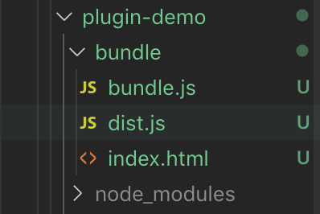

# 配置 plugin

上一节我们讲了 loader，我们知道了在 webpack 中，loader 可以完成对不同类型文件的打包，这一节我们讲一下 plugins，让我们的打包变得更加便捷。

## 什么是 plugin

`webpack` 中的 `plugin` 大多都提供额外的能力，它能使 webapck 运行到某一个时间段，做相应的事情，其实很类似 `react` 中的生命周期函数。

它们在 `webpack` 中的配置都只是把插件实例添加到 `plugins` 字段的数组中。不过由于需要提供不同的功能，不同的插件本身的配置比较多样化。

社区中有很多 webpack 插件可功能使用，包括 [webpack 官方推荐](https://webpack.js.org/plugins/) 的 以及社区中 [webpack plugins](https://github.com/webpack-contrib/awesome-webpack#webpack-plugins) ，有些的插件都会提供详细的使用说明文档，能让使用者快速上手。

下面我们就来讲几个常用的 plugin 来了解一下插件的使用方法。


## html-webpack-plugin

这个插件会帮助我们在 webpack 打包结束后，自动生成一个 html 文件，并把打包产生文件引入到这个 html 文件中去。

接下来我们家来看看这个 plugin 的用法。

上一节我们将 loader 的时候，当我们运行完 `npm run bundle`，页面会生成 bundle 文件夹，并生成了一系列的打包文件，但是就是没有相应的 index.html 文件，所以我们需要手动的去添加 index.html，并在文件中引入打包出来的 `bundle.js` 文件，过程会比较麻烦。

所以我们可以借助 `htmlWebpackPlugin` 来帮我们生成 index.html，首先我们要安装一下：

```js
npm install html-webpack-plugin -D
```

接着修改我们的 `webpack.config.js`：

```js
// 引入 htmlWebpackPlugin
const htmlWebpackPlugin = require('html-webpack-plugin');

// 给 webpack 添加一项配置 plugins
...
plugins: [
    new htmlWebpackPlugin(),
]
...
```

删除一下 bundle 文件夹，重新运行  `npm run bundle`，我们会发现新生成的 bundle 文件夹多出了 一个 index.html：


但是我们会发现，通过webpack 生成的的 html 文件，少了一个 id 为 root 的 div 元素，


我们之前在 demo 里写的代码都是插入到 root 的 div 中的，所以这里我们需要给 htmlWebpackPlugin 传入一些配置来解决上面这个问题，我们在 src 目录创建一个 index.html：

```html
<!DOCTYPE html>
<html lang="en">
<head>
	<meta charset="UTF-8">
	<title>模块化问题例子</title>
</head>
<body>
  <div id='root'></div>
</body>
</html>
```

然后修改一下 `webpack.config.js`，向 htmlWebpackPlugin 传入一些配置文件：

```js
// 给 webpack 添加一项配置 plugins
...
plugins: [
    new htmlWebpackPlugin({
        template: 'src/index.html', // 模板文件
    }),
]
...
```

删除一下 bundle 文件夹，重新运行  `npm run bundle`，我们会发现现在的index.html，有了 id 为 root 的 div 元素。


上面的 template 参数的意思就是说，htmlWebpackPlugin 是以 src 下的 index.html 作为模版去生成 html 文件的。

更多的配置大家可以参考官网的：[htmlWebpackPlugin](https://webpack.js.org/plugins/html-webpack-plugin/)


## clean-webpack-plugin

这个插件能帮我们在打包之前先删除掉打包出来的文件夹，比如我们修改了 `webpack.config.js` 中的 `output` 选项：

```js
...
output: {
    filename: 'main.js',
	path: path.resolve(__dirname, 'bundle')
}
...
```

重新运行  `npm run bundle`，我们会发现 bundle 文件夹下面的 bundle.js 文件还存在，同时并生成了 dist.js 文件：



但其实 bundle.js 在这里已经没有什么用了，所以我们需要在打包之前删除这个 bundle 文件夹，这个时候我们就可以借助 clean-webpack-plugin 来解决这个问题，首先我们安装一下：

```js
npm install clean-webpack-plugin -D
```

接着修改我们的 `webpack.config.js`：

```js
// 引入 clean-webpack-plugin
const { CleanWebpackPlugin } = require('clean-webpack-plugin');

...
plugins: [
    new htmlWebpackPlugin({
        template: 'src/index.html', // 模板文件
    }),
    new cleanWebpackPlugin(),
]
...
```

重新运行  `npm run bundle`，我们会发现，原来的 `bundle.js`  消失了。


在最新版的 `webpack` 中 `new CleanWebpackPlugin()` 中不需要写里面的目标路径，会自动清除生成的文件夹，比如是 `bundle` 文件夹，之前的版本中，我们需要传入要删除的相应文件夹名字：`new cleanWebpackPlugin(['bundle'])`；同时 `CleanWebpackPlugin` 的引入方式也要变一下。由原来的：

```js
const CleanWebpackPlugin = require('clean-webpack-plugin');
```

变成现在的：

```js
const { CleanWebpackPlugin } = require('clean-webpack-plugin');
```

关于 `CleanWebpackPlugin` 的更多用法，可以参考官网的 [clean-webpack-plugin](https://www.npmjs.com/package/clean-webpack-plugin)