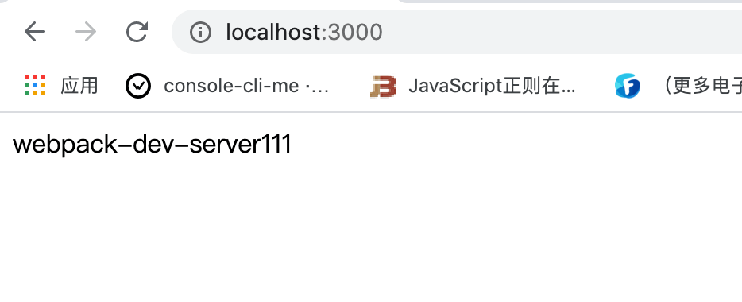

# 配置 webpack-dev-derver

我们在平时的开发过程当中，一般在我们的项目中肯定去会发一些 `ajax` 请求，而这个请求是基于 `http` 协议的，所以我们需要起一个服务器，在我们起的这个服务器中去完成我们的一系列功能开发。


这个时候就会用到 `webpack-dev-derver`，它有很多的参数可供我们配置，比如项目启动的时候自动帮我们开启浏览器、指定端口起服务器等、自动帮我们刷新浏览器

接下去我们就来讲一下：


## 安装与配置

* 安装 `webpack-dev-server`

```nginx
npm install webpack-dev-server -D
```

* 修改配置文件 `webpack.config.js`

```javascript
...
devServer: {
  contentBase: './dist', // 指定目录 起 服务器
  open: true, // 项目启动自动打开浏览器
  port: 8080 // 在 8080 端口起服务
},
...
```

* 接着我们修改一下 `package.json` 文件的 `scripts`：

```json
...
"scripts": {
  "bundle": "webpack",
  "start": "webpack-dev-server"
},
...
```

* 最后我们运行 `npm start`，我们可以看到 `webpack-dev-server` 帮我们起了一个 `http://localhost:8080/` 的服务，并自动打开了浏览器。


## 常用配置

前面例子涉及到的几个配置我就不再讲了，这里讲几个用到的比较多的配置，

### `proxy`

如果你有单独的后端开发服务器 `API`，并且希望在同域名下发送 `API` 请求 ，那么代理某些 `URL `会很有用。同时还能解决开发环境的跨域问题。


它的原理是使用 **[`http-proxy-middleware`](https://github.com/chimurai/http-proxy-middleware) **去把请求代理到一个外部的服务器。


下面是几种常用的用法，取自文章 [Webpack-dev-server的proxy用法](https://segmentfault.com/a/1190000016314976)：

* 用法一：请求到 `/api/xxx` 现在会被代理到请求 `http://localhost:3000/api/xxx`, 例如 `/api/user` 现在会被代理到请求 `http://localhost:3000/api/user`

```javascript
mmodule.exports = {
  //...
  devServer: {
    proxy: {
      '/api': 'http://localhost:3000'
    }
  }
};
```


* 用法二：如果你想要代码多个路径代理到同一个 `target` 下, 你可以使用由一个或多个「具有 `context` 属性的对象」构成的数组：

```javascript
module.exports = {
  //...
  devServer: {
    proxy: [{
      context: ['/auth', '/api'],
      target: 'http://localhost:3000',
    }]
  }
};
```


* 用法三：如果你不想始终传递 `/api` ，则需要重写路径：

```javascript
module.exports = {
  //...
  devServer: {
    proxy: {
      '/api': {
        target: 'http://localhost:3000',
        pathRewrite: {'^/api' : ''}
      }
    }
  }
};
```

请求到 /api/xxx 现在会被代理到请求 `http://localhost:3000/xxx`, 例如 /api/user 现在会被代理到请求 `http://localhost:3000/user`


* 用法四：默认情况下，不接受运行在 HTTPS 上，且使用了无效证书的后端服务器。如果你想要接受，只要设置 `secure: false` 就行。修改配置如下：

```javascript
module.exports = {
    //...
    devServer: {
        proxy: {
            '/api': {
                target: 'https://other-server.example.com',
                secure: false
            }
        }
    }
};
```


* 用法五：有时你不想代理所有的请求。可以基于一个函数的返回值绕过代理。在函数中你可以访问请求体、响应体和代理选项。必须返回 false 或路径，来跳过代理请求。

  例如：对于浏览器请求，你想要提供一个 HTML 页面，但是对于 API 请求则保持代理。你可以这样做：

```javascript
module.exports = {
  //...
  devServer: {
    proxy: {
      '/api': {
        target: 'http://localhost:3000',
        bypass: function(req, res, proxyOptions) {
          if (req.headers.accept.indexOf('html') !== -1) {
            console.log('Skipping proxy for browser request.');
            return '/index.html';
          }
        }
      }
    }
  }   
};
```


* **解决跨域原理**：上面的参数列表中有一个`changeOrigin` 参数, 是一个布尔值, 设置为 `true`, 本地就会虚拟一个服务器接收你的请求并代你发送该请求,

```javascript
module.exports = {
  //...
  devServer: {
    proxy: {
      '/api': {
        target: 'http://localhost:3000',
        changeOrigin: true,
      }
    }
  }
};
```


* 我们最后在举一个例子，梳理一下整个流程，先看代码：

```javascript
module.exports = {
  //...
  devServer: {
    '/proxy': {
      target: 'http://your_api_server.com',
      changeOrigin: true,
      pathRewrite: {
        '^/proxy': ''
      }
    }
  }
};
```

* 假设你主机名为 `localhost:8080` , 请求 `API` 的 `url` 是 `http://your_api_server.com/user/list`
* `'/proxy'`：如果点击某个按钮，触发请求 `API` 事件，这时请求 `url` 是 `http://localhost:8080/proxy/user/list`。
* `changeOrigin`：如果 `true` ，那么 `http://localhost:8080/proxy/user/list` 变为 `http://your_api_server.com/proxy/user/list`。
* `pathRewrite`：重写路径。匹配 `/proxy` ，然后变为`''` ，那么 `url` 最终为 `http://your_api_server.com/user/list`。


### `publicPath`

假设服务器运行在 `http://localhost:8080` 并且 `output.filename` 被设置为 `bundle.js`。默认 `publicPath` 是 `"/"`，所以你的包(bundle)可以通过 `http://localhost:8080/bundle.js` 访问。

可以修改 `publicPath`，将 bundle 放在一个目录：

```javascript
publicPath: "/assets/"
```

你的包现在可以通过 `http://localhost:8080/assets/bundle.js` 访问。


### `historyApiFallback`

当使用 [HTML5 History API](https://developer.mozilla.org/en-US/docs/Web/API/History) 时，任意的 `404` 响应都可能需要被替代为 `index.html`。通过传入以下启用：

```javascript
historyApiFallback: true
```

通过传入一个对象，比如使用 `rewrites` 这个选项，此行为可进一步地控制：

```javascript
historyApiFallback: {
  rewrites: [
    { from: /^\/$/, to: '/views/landing.html' },
    { from: /^\/subpage/, to: '/views/subpage.html' },
    { from: /./, to: '/views/404.html' }
  ]
}
```


### `hot`

启用 `webpack` 的模块热替换特性，下一节我们会讲到。


更多配置大家可以参考官网的介绍：

* [DevServer](https://webpack.js.org/configuration/dev-server/)


## 实现一个简单的 webpack-dev-server

因为 `webpack` 是基于 `node` 环境的，我们先在根目录下创建一个 `server.js`。

我们使用 `express` 框架来起一个服务器。同时使用 `webpack-dev-middleware` 来监听文件变化，当文件变化的时候，自动刷新一下服务器。

* 首先安装依赖

```nginx
npm install express webpack-dev-middleware -D
```

* 编写 `server.js` 文件

```javascript
const express = require('express');
const webpack = require('webpack');

// 监听文件变化
const webpackDevMiddleware = require('webpack-dev-middleware');

// 导入配置文件
const config = require('./webpack.config.js');

// 返回 webpack 的编译器
// complier 的意思就是 通过 webpack 和 其配置文件，可以随时对文件进行编译
const complier = webpack(config);

// 创建服务器的实例
const app = express();

// 中间件可以接受两个参数，编译器 和 其他的配置参数
app.use(webpackDevMiddleware(complier, {}));

// 启动一个 express 服务
app.listen(3000, () => {
	console.log('server is running');
});
```


* 接着我们修改一下 `package.json` 文件的 `scripts`：

```json
...
"scripts": {
  "bundle": "webpack",
  "start": "webpack-dev-server",
  "server": "node server.js"
},
...
```


* 最后我们运行 `npm run server`，我们可以发现在 `localhost:3000` 起了一个服务，页面上可以看到 `webpack-dev-server` 文字：


* 我们修改一下 `header.js` 文件，修改完页面不会自动刷新，我们需要自己刷新一下页面。其实效果就跟 `webpack --watch` 一样。

```javascript
function Header() {
	var dom = document.getElementById('root');
	var header = document.createElement('div');
	header.innerText = 'webpack-dev-server111';
	dom.append(header);
}

export default Header;
```

我们可以看到页面显示如图：




这次我们完成了一个简单的 `webpack-dev-server`，但是功能还是比较单一，要完善这个插件，其实很耗费精力。所以这里面我们只要了解一下就行。在工作当中我们还是使用 `webpack-dev-server` 就行了。


## 相关链接

* [在命令行中使用 `webpack`](https://webpack.js.org/api/cli/#usage-with-config-file)
* [在 `node` 中使用 `webpack`](https://webpack.js.org/api/node/#installation)

* [`webpack` 开发流程](发展历程)


## 示例代码

示例代码可以看这里：

- [webpack-dev-server 实例代码]()