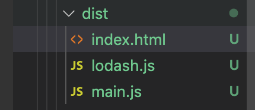
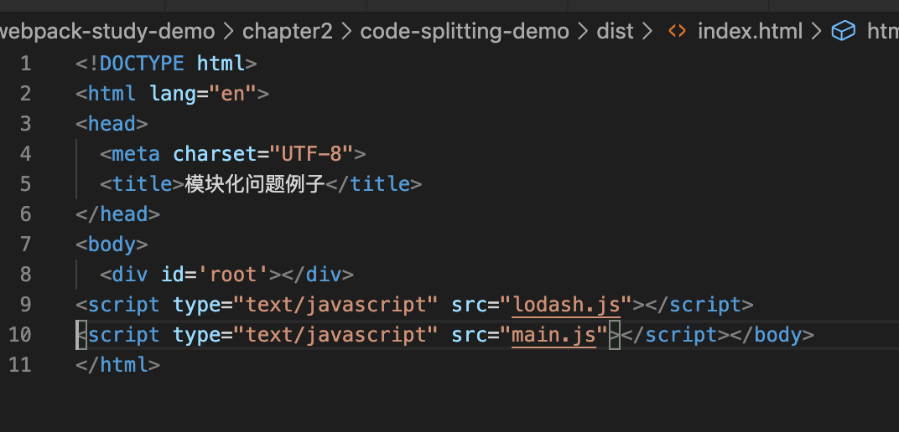
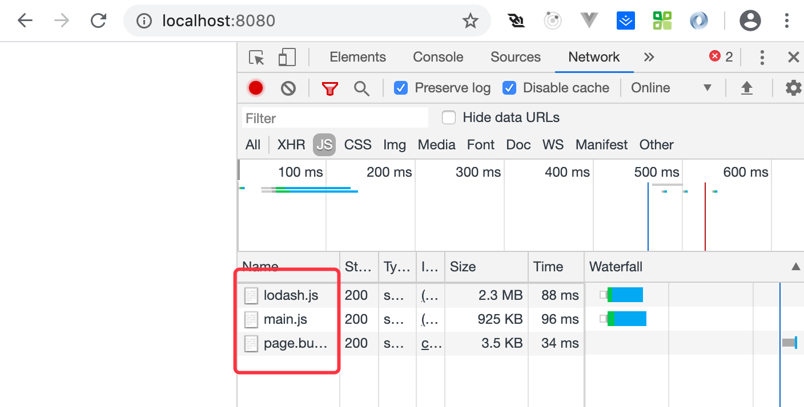
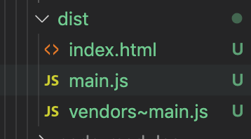
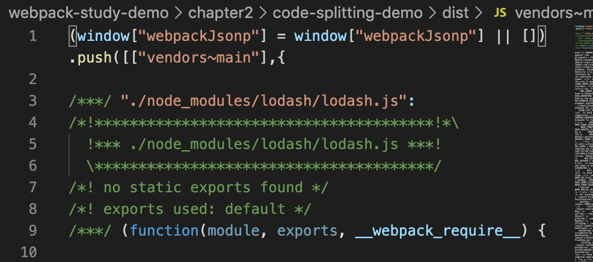
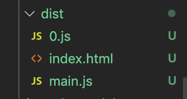
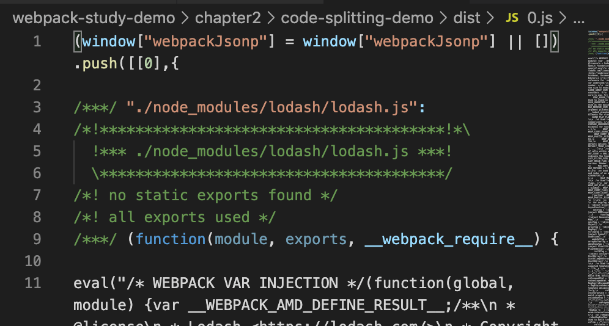

# webpack 和 Code Splitting

今天讲一下 `webpack` 中的代码分割，

对于大的 `Web` 应用来讲，将所有的代码都放在一个文件中显然是不够有效的，特别是当你的某些代码块是在某些特殊的时候才会被使用到。`webpack` 有一个功能就是将你的代码库分割成 **`chunks`(语块)**，当代码运行到需要它们的时候再进行加载。

显而易见能帮我们提升代码的性能，使用户体验更好。

实际上和 `webpack` 无关，`webpack` 只是可以帮助我们更简单的实现代码分割。两种方式:

&nbsp;

## 举个🌰

首先我们安装一个 `lodash` ，

```javascript
npm install lodash -D
```

接着我们在 `index.js` 中引入：

```javascript
import _ from 'lodash';

console.log(_.join(['a', 'b', 'c'], '***'));
```

接着我们运行一下 `npm run dev`，开启服务：

我们看到：


我们也会发现打包后的 `main.js` 是 `1.39MB`：


我们会发现一个问题，如果我们引入了很多的第三方包，并同时都打包到 `main.js` 中的时候，`main.js` 会变得很大，用户加载这个文件也会变慢，所以我们在想如果这个类库能打包到各自的 `js` 中，并分别引入的话，这样就能提高性能，我们的 `main.js` 只需要管好自己的代码就行。

&nbsp;

我们新建一个 `lodash.js`，这个文件的作用就是将 `lodash` 挂到 `window` 上。

```javascript
// 加载lodash，挂载window 上

import _ from 'lodash';
window._ = _;
```

我们修改一下 `index.js`：

```javascript
// import _ from 'lodash';

console.log(_.join(['a', 'b', 'c'], '***'));
```

接着我们修改一下 `webpack` 配置文件 `webpack.common.js`：

```javascript
// ...

module.exports = {
  entry: {
    lodash: './src/lodash.js',
    main: './src/index.js',
  },
  // ...
}

// ...
```

我们打包一下 `npm run bundle`，我们可以 `dist` 目录多生成了 `lodash.js`



我们可以看到各自的大小：


以及他们在 `index.html` 中的引入：



我们重新运行 `npm run dev`：我们可以看到在代码成功运行：





&nbsp;

我们将 工具库函数 `lodash` 抽取到了 `lodash.js`，`main.js` 只负责我们的业务代码，这样当我们修改了相关的业务代码的时候，就不需要重新去打包 `lodash.js` 了，浏览器会缓存不变的代码，或者我们可以将其放到 `cdn` 上，

这样能使，性能更快，体验更好。

&nbsp;

这是我们自己手动做的，我们看看 `webpack` 如何帮我们做代码分割。

&nbsp;

## 两种方式

使用 `webpack` 帮我们做代码分割有两种方式。

&nbsp;

### 同步引入，分割代码： 

这个很简单只需要在 `webpack.dev.js` 中做 `optimization` 的配置即可。

```javascript
// ...

optimization: {
  splitChunks: {
    chunks: 'all', // 公用的类库拆分，默认全部
  }
},

// ...
```

我们将  `webpack.common.js` 中的  `entry` 中配置的 `lodash` 去掉。

```javascript
// ...

module.exports = {
  entry: {
    main: './src/index.js',
  },
  // ...
}

// ...
```

 接着我们重新打包一下 `npm run bundle`，我们可以看到 `dist` 下面的内容：



多了一个 `vendors~main.js`，我们打开看一波，其实这个文件就是对 `lodash` 的打包：




&nbsp;

### 异步引入，分割代码(import): 

异步代码引入切割代码，我们无需做任何配置，会自动进行代码分割，放置到新的文件中。

#### 实现方式

* `CommonJs`：使用 [`require.ensure`](https://www.html.cn/doc/webpack2/guides/code-splitting-require/) 来实现
* `ES6`：动态 `import`，我们接下去的例子

我们新建一个 `async.js` 文件，用于异步导入 `lodash`：

```javascript
export default function getComponent() {
  return import('lodash').then(({ default: _ }) => {
    var element = document.createElement('div');
    element.innerHTML = _.join(['Hello', 'Darrell'], '-');
    return element;
  })
}
```

接着我们在 `index.js` 中引入使用：

```javascript
import getComponent from './async.js'

getComponent().then(element => {
  document.body.appendChild(element);
});
```

在打包出来的 `dist` 目录下多出了 `0.js`：



里面的内容就是 `lodash.js`：



#### 注意点：

在早些 `webpack` 版本中是不支持 `import('lodash').then()` 这种方法的，打包过程中会报错，我们需要借助 `babel` 的一个插件 `babel-plugin-dynamic-import-webpack` 帮我们解决这个问题。

安装：

```javascript
npm i babel-plugin-dynamic-import-webpack -D
```

在 `.babelrc` 中进行配置：

```json
{
  "presets": [
    [
      "@babel/preset-env",
      {
        useBuiltIns: 'usage'
      }
    ],
    "@babel/preset-react"
	],
	"plugins": ["dynamic-import-webpack"]
}
```

接着我们重新打包就可以使用这类语法了。

&nbsp;

## 相关链接：

&nbsp;

## 示例代码

示例代码可以看这里：

* [code splitting 示例代码](https://github.com/darrell0904/webpack-study-demo/tree/master/chapter2/code-splitting-demo)