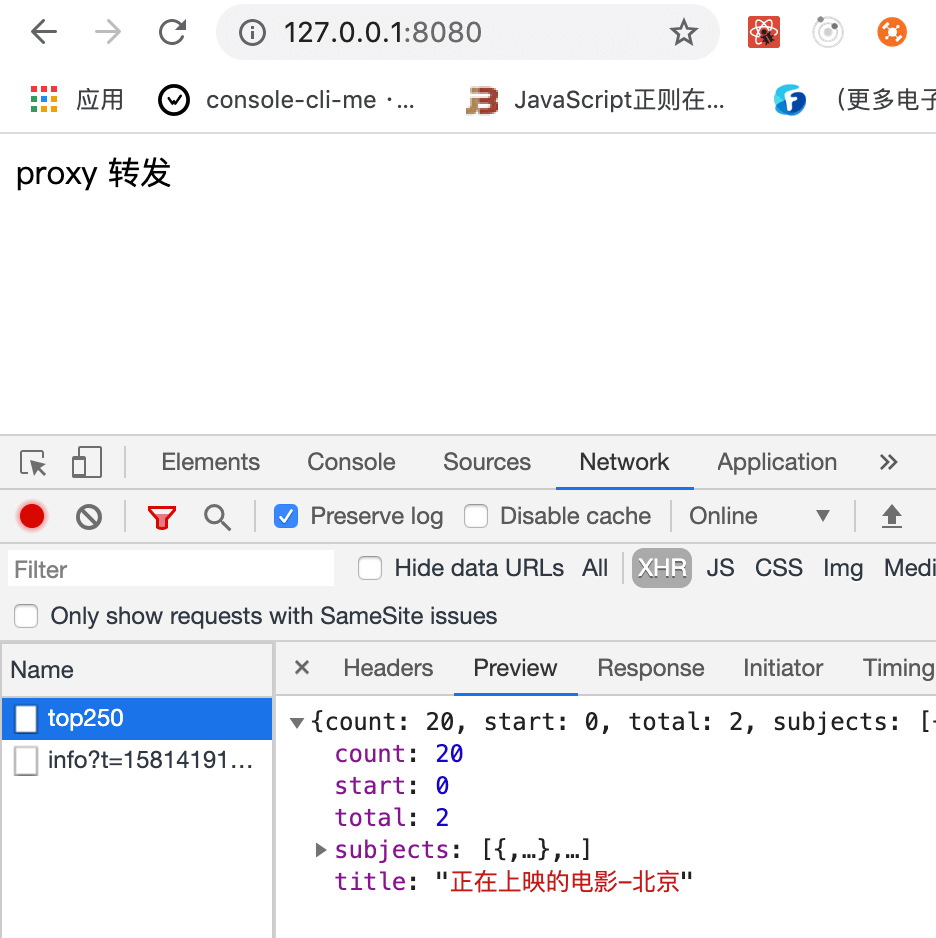
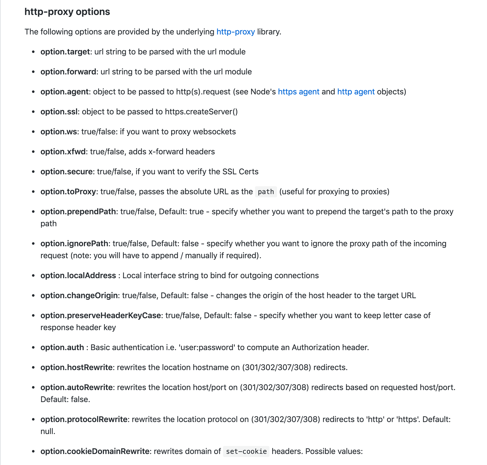
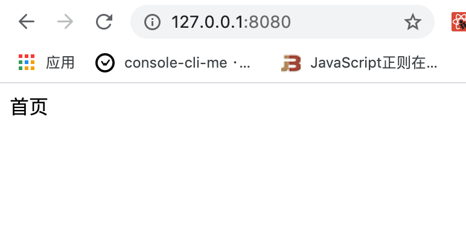
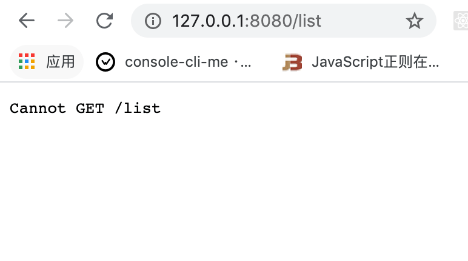
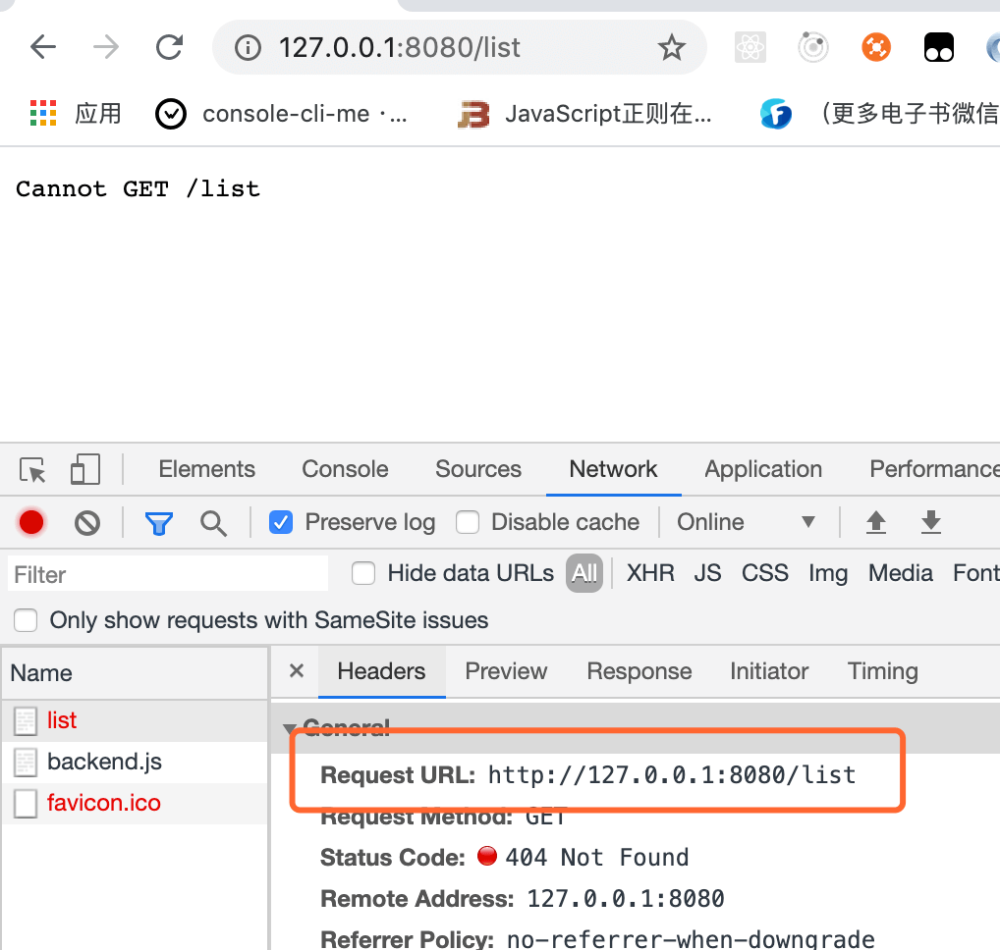
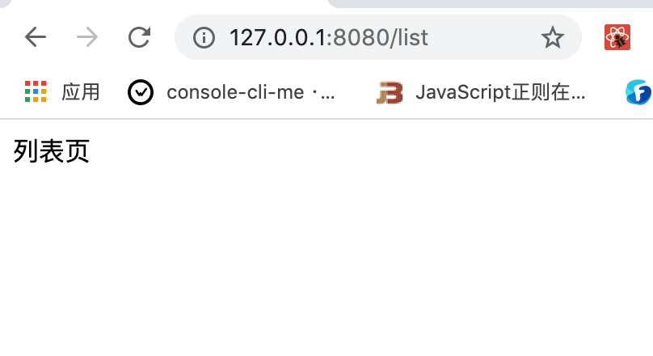
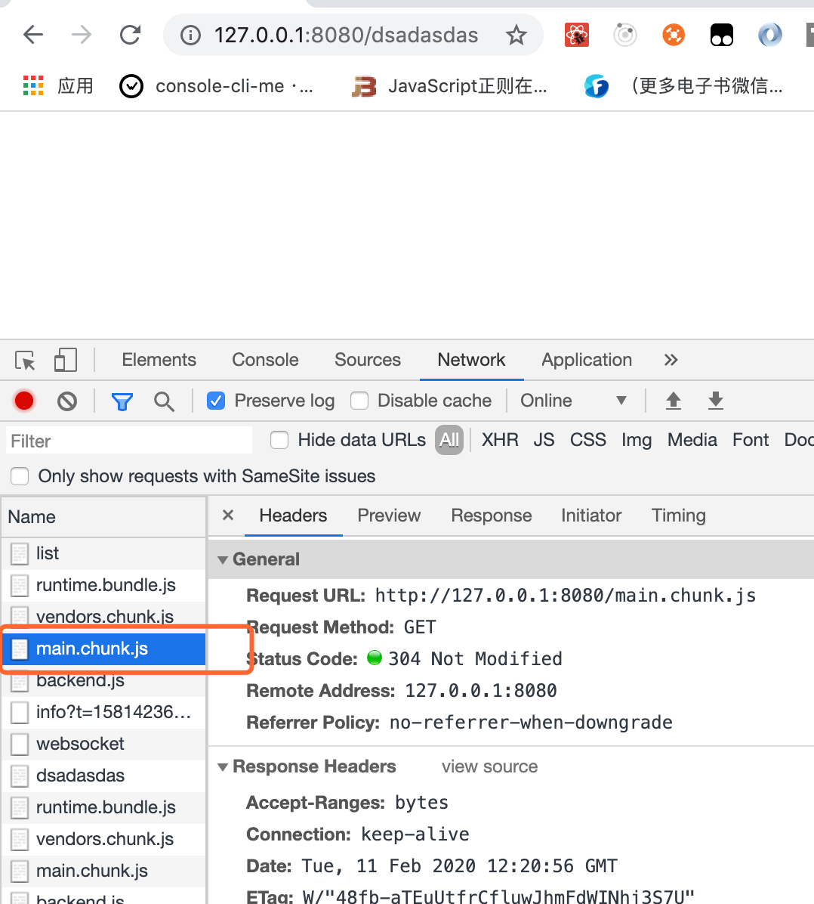
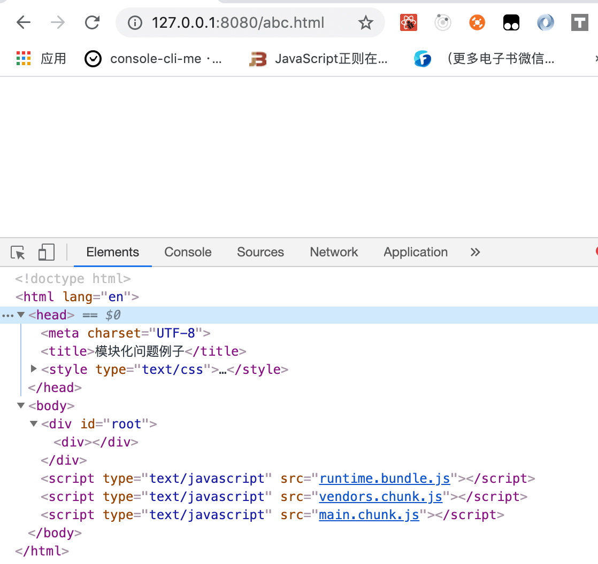
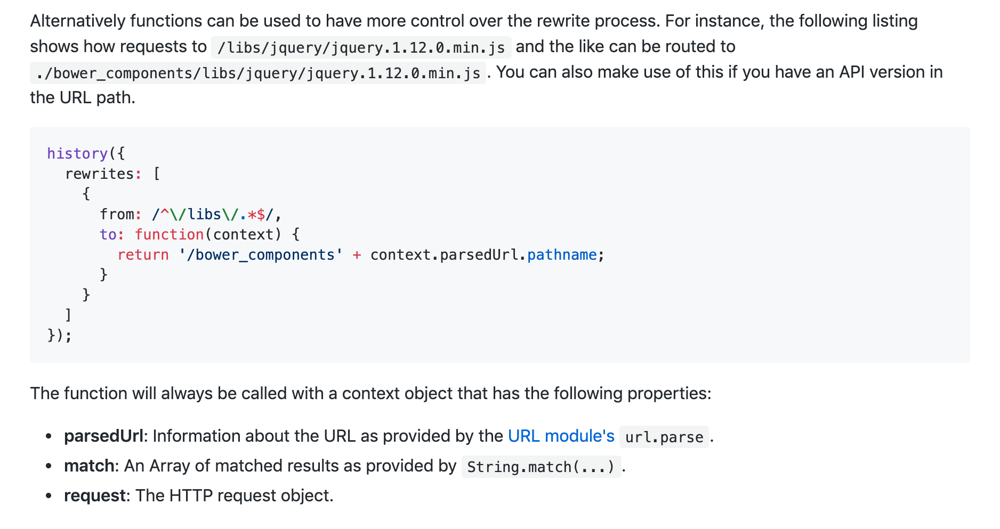

# webpack-dev-server 高级配置

今天我们再来回顾一下 `webpack-dev-server` 的一些配置，主要讲两个，一个是关于请求转发的 `proxy` 配置，一个是针对单页应用路由跳转的 `historyApiFallback` 配置。

虽然我们之前都有讲到过，今天权当是再巩固一下，奥利给！！！

&nbsp;

##  `proxy`：请求转发

### 测试代码

修改 `index.js`，在 `react` 的组件加载完成的生命周期函数中去请求豆瓣的 `top 250` 影单，我们使用 `axios` 库来请求：

```jsx
import React, { Component } from 'react';
import ReactDom from 'react-dom';
import axios from 'axios';

class App extends Component {

  componentDidMount() {
    axios.get('https://douban.uieee.com/v2/movie/top250')
      .then((res) => {
      console.log(res);
    })
  }

  render() {
    return (
      <div>
        proxy 转发
      </div>
    );
  }
}

ReactDom.render(<App />, document.getElementById('root'));

```

安装 `axios`：

```javascript
npm install axios -S
```

我们运行 `npm run dev`，可以在页面上看到，成功的请求了豆瓣的影单：


我们请求豆瓣接口直接是将接口的全地址写死的，但是一般来说，我们开发环境和线上环境使用的服务器可能不是同一台，开发用的是测试服务器，线上用的是线上服务器。所以一般我们会这么写：

```jsx
...

class App extends Component {
  componentDidMount() {
    axios.get('/movie/top250')
      .then((res) => {
      console.log(res);
    })
  }
  ...
}

...

```

但是这样写的话，我们的接口请求地址变成了 `http://127.0.0.1:8080/movie/top250`，当然这样请求肯定是不能成功的，如果我们能实现当我们访问 `http://127.0.0.1:8080/movie/top250` 帮我们转发到 `https://douban.uieee.com/v2/movie/top250` 这个接口那就太完美了。

我们可以通过配置 `proxy` 来完成这个转发。

&nbsp;

### 配置

我们在开发配置文件 `webpack.prod.js` 中 `devServer` 增加 `proxy` 配置：

```javascript
...

const devConfig = {
  ...
  devServer: {
    overlay: true,
    contentBase: './dist',
    port: 8080,
    hot: true,
    proxy: {
      '/movie/': {
        target: 'https://douban.uieee.com/v2',
      }
    }
  },
  ...
}
...
```

我们重新打包一下，可以发现我们接口可以正常请求了：


### 参数讲解

#### `pathRewrite`

假如我们开发服务器上暂时还没有 `top250` 的数据，后端工程师暂时告诉我们可以先使用 `in_theaters` 这个数据进行调整开发。

一般来说我们需要去修改请求的接口链接，将 `/movie/top250` 改为 `/movie/in_theaters`，但是有了 `webpack-dev-server` 之后，我们就不需要去改接口链接了。

我们可以做如下配置，配置 `pathRewrite` 属性，将 `top250` 转发到 `in_theaters` 上：

```javascript
...

const devConfig = {
  ...
  devServer: {
    overlay: true,
    contentBase: './dist',
    port: 8080,
    hot: true,
    proxy: {
      '/movie/': {
        target: 'https://douban.uieee.com/v2',
        pathRewrite: {
          'top250': 'in_theaters'
        },
      }
    }
  },
  ...
}
...
```

我们可以接口请求了最新的正在上映的电影列表：




&nbsp;

#### `secure`

默认情况下，`devServer` 是不接受运行在 HTTPS 上，且使用了无效证书的后端服务器。

但是有的时候我们就是要做请求转发的网址是一个 `https` 的网址，这个时候就需要配置 `secure: false`，来完成对 `https` 的请求网址的转发。

```javascript
proxy: {
  "/movie/": {
    target: "https://douban.uieee.com/v2/top250",
    secure: false
  }
}
```


&nbsp;

#### `bapass`

有时你不想代理所有的请求。可以基于一个函数的返回值绕过代理。在函数中你可以访问请求体、响应体和代理选项。必须返回 `false` 或路径，来跳过代理请求。

```javascript
proxy: {
  "/movie/": {
    target: "https://douban.uieee.com/v2",
    bypass: function(req, res, proxyOptions) {
      if (req.headers.accept.indexOf("html") !== -1) {
        console.log("Skipping proxy for browser request.");
        return "/index.html";
      }
    }
  }
}
```

上面的配置是，当你请求返回的是一个 `html` 文件的时候，我们就直接跳过接口请求，直接返回项目根路径下面的 `index.html`。

&nbsp;

#### `context`

如果要将多个特定路径代理到同一目标，我们就可以使用一个或多个具有上下文属性的对象数组来完成。把这个数组放到 `context` 属性中去完成转发：

```javascript
proxy: [{
  context: ["/auth", "/api"],
  target: "http://localhost:3000",
}]
```


&nbsp;

#### `index`

默认情况下，我们直接去代理根目录是不能进行接口转发的，因为 `webpack-dev-server` 默认是不支持对根目录的接口转发的。

```javascript
proxy: {
  "/": {
    target: "https://douban.uieee.com/v2/top250",
    secure: false
  }
}
```

我们如果想要对根目录进行转发，我们需要配置 `index` 为 `false` 或者是 `''`。

```javascript
module.exports = {
  ...
  devServer: {
    index: '', // specify to enable root proxying
    proxy: {
      context: () => true,
      target: 'http://localhost:1234'
    }
  }
};
```

&nbsp;

#### `changeOrigin`

有些情况下，一些网站会对 `origin` 做一些限制，它防止外部网站用爬虫去爬取他的一些内容，这会导致可能当我们代理了一些网站去请求数据的时候会拿不到内容。这个时候我们只要配置 `changeOrigin` 就行

```javascript
module.exports = {
  ...
  devServer: {
    proxy: {
      '/movie/': {
        target: 'https://douban.uieee.com/v2',
        changeOrigin: true
      }
    }
  }
};
```

一般情况下，我们会一直把这个参数写着的。

&nbsp;

#### `headers`

我们可以在转发的时候配置请求头的信息，变更一下请求头。我们也可以修改请求 `cookie` 的信息等。

```javascript
module.exports = {
  ...
  devServer: {
    proxy: {
      '/movie/': {
      	target: 'https://douban.uieee.com/v2',
      	changeOrigin: true,
      	headers: {
          host:'www.example.org',
          cookie: 'isLogin=1' // 判断是否登录的 cookie 信息
        }
      }
    }
  }
};
```

更多配置，大家可以参考 [更多 headers 配置](https://en.wikipedia.org/wiki/List_of_HTTP_header_fields#Request_fields)。


#### 更多参数

`webpack-dev-server` 底层使用的是  [http-proxy-middleware](https://github.com/chimurai/http-proxy-middleware) 这个包，这个包帮我们完成各种各样丰富的配置的，如果想要学习更多配置，大家可以看看他的文档。




&nbsp;

## `historyApiFallback`：单页面路由跳转

这个配置参数能帮我们很好的解决，单页面应用的路由问题。

### 写点代码

我们新建 `home.js` 和 `list.js` 作为我们路由切换中的两个页面：

```jsx
// home.js
import React, { Component } from 'react';

class Home extends Component {
  render() {
    return <div>首页</div>;
  }
}

export default Home;

// list.js
import React, { Component } from 'react';

class List extends Component {
  render() {
    return <div>列表页</div>;
  }
}

export default List;

```

我们安装 `react-router-dom` 来帮助我们做 `react` 中的路由切换：

```javascript
npm install react-router-dom -S
```

接着我们修改入口文件 `index.js`，完成上面两个页面的路由切换：

```jsx
import React, { Component } from 'react';
import { BrowserRouter, Route } from 'react-router-dom';
import ReactDom from 'react-dom';
import Home from './home';
import List from './list';

class App extends Component {

  render() {
    return (
      <BrowserRouter>
        <div>
          <Route path="/" exact component={Home} />
          <Route path="/list" component={List} />
        </div>
      </BrowserRouter>
    );
  }
}

ReactDom.render(<App />, document.getElementById('root'));

```

上面的代码意思就是当我们访问根目录的时候，展示的是 `Home` 页面，访问 `list` 路径的时候，展示的就是 `List` 页面。


我们打包一下，可以看到页面跑起来了：



当我们访问 `http://127.0.0.1:8080/list` 的时候，页面却告诉我们页面找不到：




造成这个错误的原因就是，当我们访问 `http://127.0.0.1:8080/list` 这个链接的时候，后端也就是 `webpack-dev-server` 以为我们访问的是 `list` 这个页面，但是我们的项目是单页应用，项目中只有一个 `index.html`，并没有 `list` 这个页面，所以他就会提示我们页面找不到。 



这个时候我们就需要在 `webpack-dev-server` 中配置 `historyApiFallback` 这个参数，我们修改开发配置文件 `webpack.dev.js`：

```javascript
module.exports = {
  //...
  devServer: {
    historyApiFallback: true
  }
};
```

重新打包一下，我们在访问一下  `http://127.0.0.1:8080/list` 这个页面，这个时候列表页就出来了：



配置了这个参数后，当我们服务器找不到我们访问的地址的时候，即请求 `404` 的时候，或者说是在服务器上的任何一个路径请求，我们的服务器都会给我们转化为对根路径（`index.html`）的请求。所以他都会去引入 `index.html` 页面。

也就是说不管我们请求什么路径，他都会给我们返回我们根路径的代码，当我请求 `http://127.0.0.1:8080/dsadasdas` 实际上页面上加载的也是 `index.html` 的 `js`：



既然请求的是我们的 `index.html` 的代码，那当然我们单页应用的路由可以生效啦。


&nbsp;

### 更多 `historyApiFallback` 配置

他可以配置一个 `rewrites` 的规则，

```javascript
module.exports = {
  //...
  devServer: {
    historyApiFallback: {
      rewrites: [
        { from: /abc.html/, to: '/index.html' },
      ]
    }
  }
};
```

上面的配置的意思是，当我们去访问 `abc.html` 的时候，就帮我们重定向到 `index.html` 中去，我们重新打包一下代码，可以看到当我们访问 `http://127.0.0.1:8080/abc.html` 的时候，实际上展示出来的是 `index.html`：



我们回过头来想一下之前我们写成 `true`，实际上意思就是不管你写什么路径，`webpack-dev-server` 都会帮你重定向到 `index.html`。

我们还可以给 `rewrites` 中的 `to` 参数导出一个函数，自定义我们要重定向的网页内容。

```javascript
module.exports = {
  //...
  devServer: {
    historyApiFallback: {
      rewrites: [
        {
          from: /abc.html/,
          to: function(context) {
            return '/bower_components' + context.parsedUrl.pathname;
          }
        },
      ]
    }
  }
};
```



&nbsp;

一般来说我们只要配置 `true` 就可以解决大部分问题了，这个配置还有很多配置可选项，我们可以在用到的时候再去查阅 [historyApiFallback 底层包 connect-history-api-fallback](https://github.com/bripkens/connect-history-api-fallback)。


&nbsp;

## 相关链接

-  [Webpack 官网 devServer](https://webpack.js.org/configuration/dev-server/)
- [http-proxy-middleware](https://github.com/chimurai/http-proxy-middleware)
- [historyApiFallback 底层包 connect-history-api-fallback](https://github.com/bripkens/connect-history-api-fallback)

&nbsp;

## 示例代码

示例代码可以看这里：

- [webpack-dev-server 高级配置  示例代码](https://github.com/darrell0904/webpack-study-demo/tree/master/chapter3/webpack-dev-server-demo)