# 如何编写一个简易的 Webpack

之前都是学习 `webpack` 的使用，今天我们来写一个简单的 `webpack`。


## 第一种方式

第一种我们以之前讲到的 `webpack` 流程的形式，来写一个简易的 `webpack`，我们新建一个文件夹 `class-webpack-demo`，并创建：

* `lib`：webpack 核心代码文件夹，在其中我们新建 `compiler.js`（编译文件），`index.js`（入口文件），`parser.js`（工具函数，包括 生成 `ast`、寻找依赖、将 `ast` 转化为源代码）
* `src`：业务代码文件夹
* `simplepack.config.js`：webpack 配置文件

### 完善 `src` 代码：

我们新建 `index.js` 和 `greeting.js` 两个文件，主要是在浏览器上打印出一行文字 `Hello Darrell`：

```javascript
// index.js

import { greeting } from './greeting.js';
document.write(greeting('Darrell'));

// greeting.js

export const greeting = (name) => {
  return 'hello' + name;
}
```


### 完善 `lib` 代码

首先我们先来回顾一下之前讲过的 `webpack` 流程，`webpack` 会在读取号配置文件后，运行 `run` 方法，并通过配置的入口文件，循环遍历出从入口文件开始所用到的所有依赖，并进行模块的打包，打包完成之后，`webpack` 会将编译构建好的文件输出到磁盘上，完成打包。

在这里我们简单的将 `webpack` 打包分为三步：

* 处理入口文件，并执行 `run` 方法，开始构建
* 从入口文件开始，循环遍历所有依赖，进行打包，并放到 `modules` 属性中
* 输出构建好的文件

#### 配置文件

我们配置文件就简单一点，就只设定一个入口和出口。

```javascript
// simplepack.config.js
'use strict';
const path = require('path');

module.exports = {
  entry: path.join(__dirname, './src/index.js'),
  output: {
    path: path.join(__dirname, './dist'),
    filename: 'main.js'
  }
};
```

#### 主文件

##### 开始构建

首先我们先来完善 `index.js`，这个是 `webpack` 的入口文件，在这里我们可以导入 `compiler` 和配置参数，并通过运行 `compiler.run()` 方法开始构建

```javascript
// index.js

const Compiler = require('./compiler');
const options = require('../simplepack.config');

new Compiler(options).run();
```

接着就是最主要的 `compiler` 编译器的实现，通过上面的分析，我们需要定义一个 `compiler` 类，接收配置文件的配置参数，并且在 `compiler` 类上拥有 `run`（开始构建）、`buildModule`（打包模块）、`emitFiles`（输出打包文件）三个方法，具体如下：

```javascript
// compiler.js
const fs = require('fs');
const path = require('path');

module.exports = class Compiler {
  constructor(options) {
    const { entry, output } = options;
    this.entry = entry;
    this.output = output;
    // 用来放置处理后的模块
    this.modules = [];
  }
  // 开始构建
  run() {}

  // 打包模块
  // filename：文件名称
  // isEntry：是否是入口文件
  buildModule(filename, isEntry) {}

  // 输出文件
  emitFiles() {}
}
```

在 `run` 方法中，我们需要对入口文件进行打包，获取他的依赖，并对其依赖进行打包，直到所有的依赖都已经被打包完为止。

```javascript
// compiler.js
// ...
run() {
  // 打包入口文件
  const entryModule = this.buildModule(this.entry, true);

  // 将打包好的 module 塞入到 modules 中
  this.modules.push(entryModule);
  
  // 遍历 modules，并将他们的依赖一次进行打包
  this.modules.map((_module) => {
    _module.dependencies.map((dependency) => {
      this.modules.push(this.buildModule(dependency));
    })
  });

  // 输出构建结果
  this.emitFiles();
}
```

##### 构建文件

接着我们就来编写 `buildModule` 方法，在这个方法中，我们会对输入的文件进行打包，传入 `isEntry` 这个参数的原因是因为，除了入口文件之外，其他文件的依赖都是相对路径，我们需要将这些路径转化为相应的绝对路径之后，才能对其进行打包。

构建过程中我们会将代码转成 `ast`，并分析其依赖，最终在将处理完的代码转回原来的代码（`source`）,这就完成了对一个文件的构建：

```javascript
// compiler.js
// ...
buildModule(filename, isEntry) {
  let ast;
  // 判断是否是入口文件
  // 是就直接使用 filename，其本身就是绝对路径
  // 不是就是拼成绝对路径
  if (isEntry) {
    ast = getAST(filename);
  } else {
    let absolutePath = path.join(process.cwd(), './src', filename);
    ast = getAST(absolutePath);
  }

  // 输出结果
  return {
    filename, // 文件名称
    dependencies: getDependencis(ast), // 依赖图
    transformCode: transform(ast), // 源码
  }
}
```

这里面使用了三个方法，我写在了 `parser.js` 中：

* `getAST`：通过 `babylon` 获取代码 `AST`，关于 `AST` 的知识，大家可以参考 [AST抽象语法树——最基础的javascript重点知识，99%的人根本不了解](https://segmentfault.com/a/1190000016231512)
* `getDependencis`：通过 `babel-traverse` 获取文件的依赖列表
* `transform`：通过 `babel-core` 将 `AST` 转化为源码

##### 输出文件

最后就是输出文件了，在这之前，我们回顾一下 `webpack` 的模块机制。

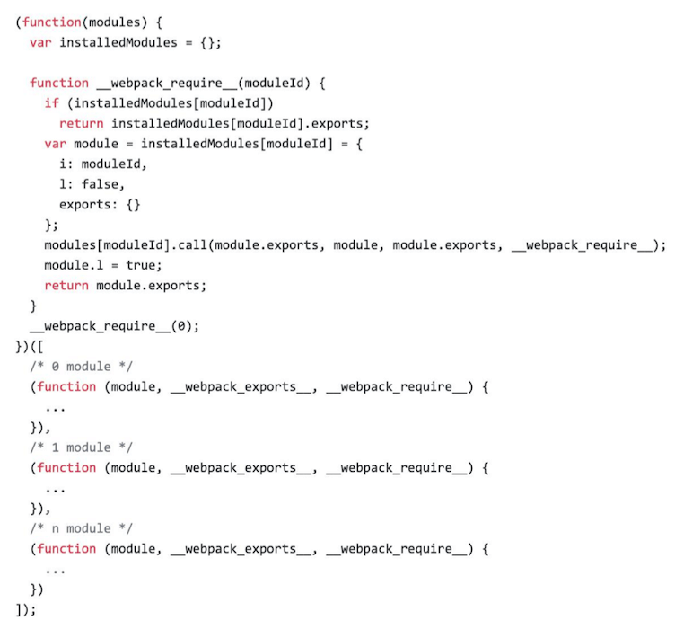

通过上图我们可以看到：

* 通过 `webpack` 打包出来的是一个 `IIFE`（匿名闭包）
* 接受参数是 `modules`，它是一个数组，每一项是一个模块初始化函数
* `__webpack_require` 用来加载模块，返回 `modules.exports`
* 通过 `__webpack_require(0)` 加载第一个模块，来启动程序。

于是我们可以来编写 `emitFiles` 方法：

```javascript
// compiler.js
// ...
emitFiles() {
  const outputPath = path.join(this.output.path, this.output.filename);
  let modules = '';
  // 将打包好的模块以键值对的形式，拼接起来
  // 跟 webpack 一样传入
  // require：加载函数
  // module：要导出的 return 的 module
  // exports：module.exports
  this.modules.map((_module) => {
    modules += `'${ _module.filename }': function (require, module, exports) { ${ _module.transformCode } },`
  });

  // 拼接导出文件 IIFE
  const bundle = `
		(function(modules) {
			function require(fileName) {
				const fn = modules[fileName];
				const module = { exports : {} };

				fn(require, module, module.exports);
    		return module.exports;
			}
			require('${this.entry}');
		})({${modules}})
	`;
  
  // 输出文件到 output 文件夹
  fs.writeFileSync(outputPath, bundle, 'utf-8');
}
```

打包出来 `main.js` 文件如下图所示：

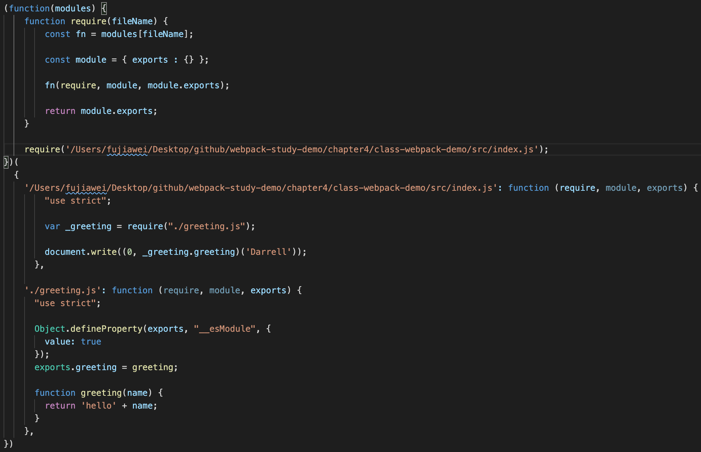

我们在 `dist` 目录下新增 `index.html`，并引入打包好的 `main.js`，打开 `index.html`，我们可以看到输出了 `helloDarrell`。


&nbsp;

## 第二种方式

### 写点代码

我们新建一个 `src` 目录，并创建 `index.js`、`message.js`、`word.js` 三个文件，并在根目录创建一个打包 `bundle.js` 文件，我们在 `bundle.js`  中做一些 `webpack` 要做的事情

```javascript
// index.js
// 项目的入口文件
import message from './message.js';
console.log(message);

// message.js

import { word } from './word.js';
const message = `say ${word}`;
export default message;

// word.js
export const word = 'hello';
```

&nbsp;

### 模块分析

打包的第一步我们需要去读取项目的入口文件，并且去分析其中的代码。

我们从模块分析先开始讲起，首先我们新建一个 `moduleAnalyser` 的方法，此方法接受一个参数，就是要分析的文件的路径，帮助我们分析文件的信息。

#### 读取文件信息

我们通过 `Node` 的 `fs` 模块读取文件内容：

```javascript
const fs = require('fs');

const moduleAnalyser = (filename) => {
  const content = fs.readFileSync(filename, 'utf-8');
  console.log(content);
}

moduleAnalyser('./src/index.js')
```

接着我们修改 `package.json` 中的 `scripts` 中新增一条命令，帮祝我们使用 `Node` 运行 `bundle.js` 文件：

```javascript
"scripts": {
  "bundle": "node bundler.js"
},
```

我们运行一下 `npm run bundle`，我们可以看到命令行输出了 `index.js` 的文件信息：


我们使用 `cli-highlight` 给我们的代码加一点颜色，高亮显示代码，安装依赖：

```javascript
npm install cli-highlight -g
```

接着修改 `scripts` 命令，加上 `highlight`：

```javascript
"scripts": {
  "bundle": "node bundler.js | highlight"
},
```

我们重新运行 `npm run bundle`，这个时候我们的代码便有了颜色：


#### 获得文件依赖

获得文件信息之后，我们需要去获得这个文件中所用到的依赖，

```javascript
import message from './message.js';
```

就如同上面代码中的依赖路径信息，即 `./message.js`。

这个时候我们可以使用 `babel` 的一个工具 [`@babel/parser`](https://www.babeljs.cn/docs/babel-parser) 帮我们做这件事情，它会将我们的代码转化为抽象语法树，即 `AST`，我们首先安装依赖：

```javascript
npm install @babel/parser -D
```

接着修改 `moduleAnalyser` 函数：

```javascript
const fs = require('fs');
const parser = require('@babel/parser');

const moduleAnalyser = (filename) => {
  const content = fs.readFileSync(filename, 'utf-8');
  const ast = parser.parse(content, {
    sourceType: 'module'
  });
  console.log('--ast---\n', ast);
}

moduleAnalyser('./src/index.js')
```

重新打包一下，我们可以看到：

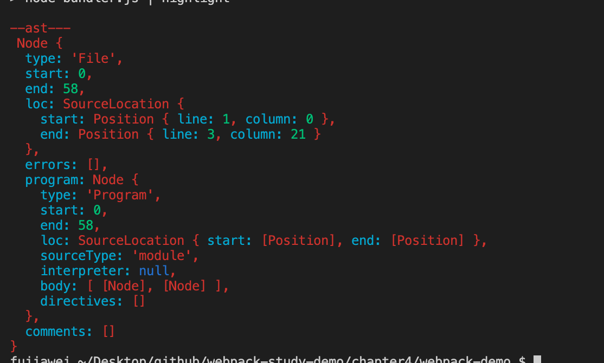

他能很好的表述我们引入的这段代码的意思，我们还可以代印其中 `program` 属性下的 `body` 字段：

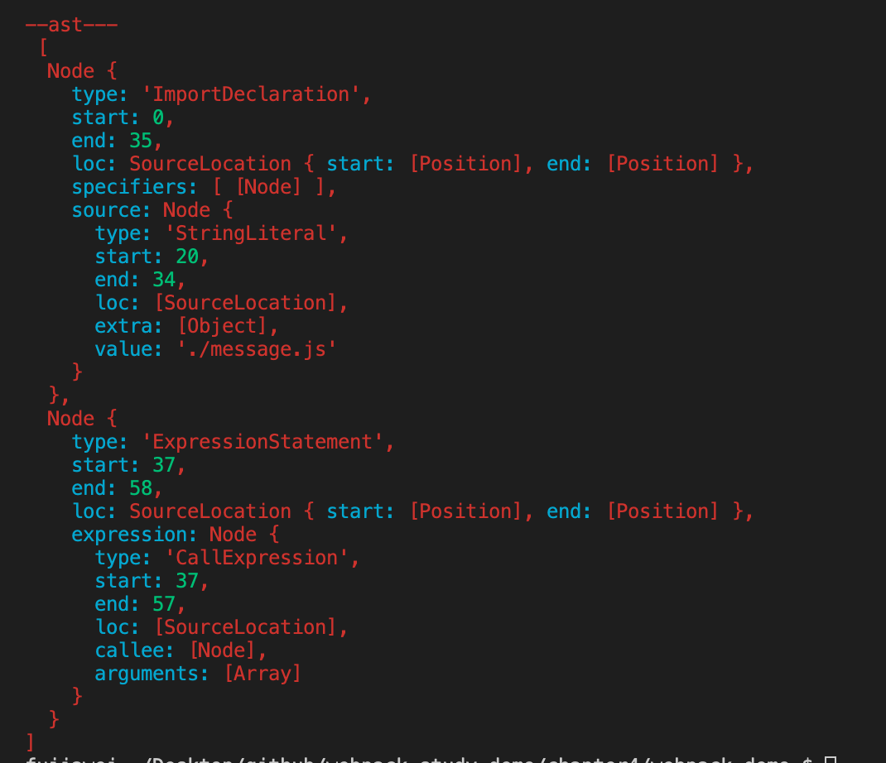

在这个字段里我们能更清晰的看到哪一些是引用的申明 `ImportDeclaration`，哪一些是表达式的语句 `ExpressionStatement`，

这个时候我们如果再在 `index.js` 中引入一个 `message1.js`：

```javascript
import message from './message.js';
import message from './message1.js';

console.log(message);
```

我们重新打印一下 `program` 属性下的 `body` 字段，我们可以发现出现了两个引用申明 `ImportDeclaration`，一个表达式申明 `ExpressionStatement`：

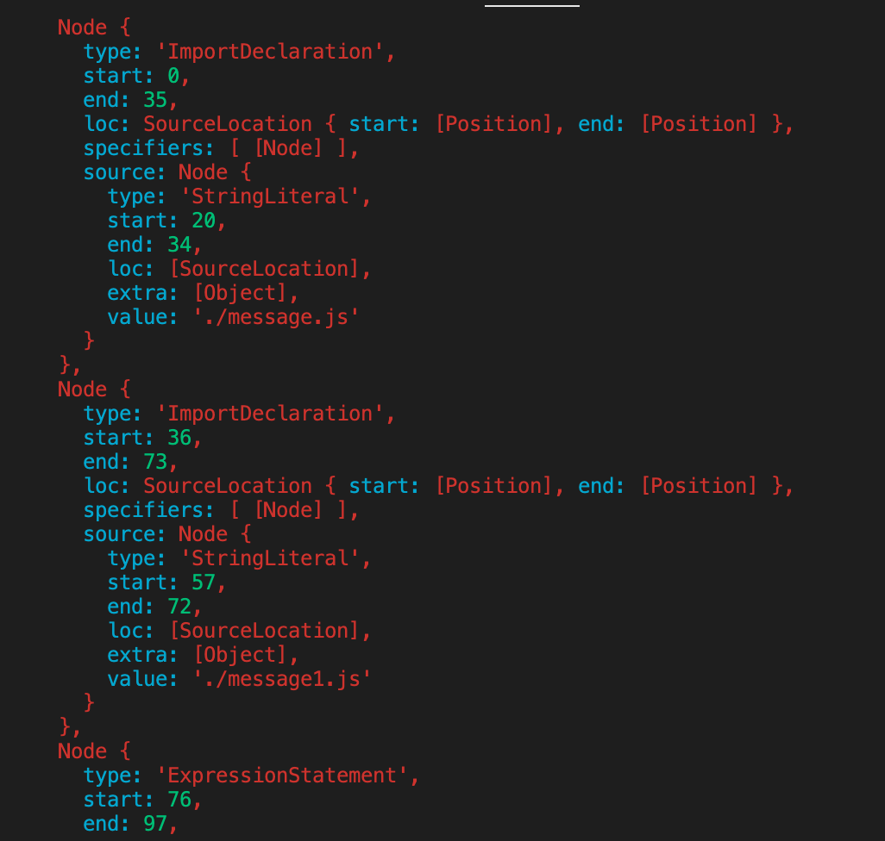

既然我们拿到了代码有几个引用属性，我们就可以遍历我们的 `body` 字段，将这些 `ImportDeclaration` 输出出来，手动去遍历还是有点麻烦，我们可以接着 `babel` 的 [`@babel/traverse`](https://www.babeljs.cn/docs/babel-traverse) 这个工具帮助我们来完成这件事，我们安装依赖：

```javascript
npm install @babel/traverse -D
```

接着我们在 `bunder.js` 中去进行使用：

```javascript
const fs = require('fs');
const parser = require('@babel/parser');
const traverse = require('@babel/traverse').default;

const moduleAnalyser = (filename) => {
  const content = fs.readFileSync(filename, 'utf-8');
  const ast = parser.parse(content, {
    sourceType: 'module'
  });
  traverse(ast, {
    ImportDeclaration({ node }) {
      console.log(node);
    }
});
}

moduleAnalyser('./src/index.js')
```

我们引入 `traverse`，它接受两个参数，一个是 `AST`，第二个就是对象，当 `ast` 中有引用申明 `ImportDeclaration` 的时候，它就会进入 `ImportDeclaration({ node }) {}` 这个方法，`ImportDeclaration` 函数参数是一个对象，对象中有 `node` 这个字段，值如下图所示：

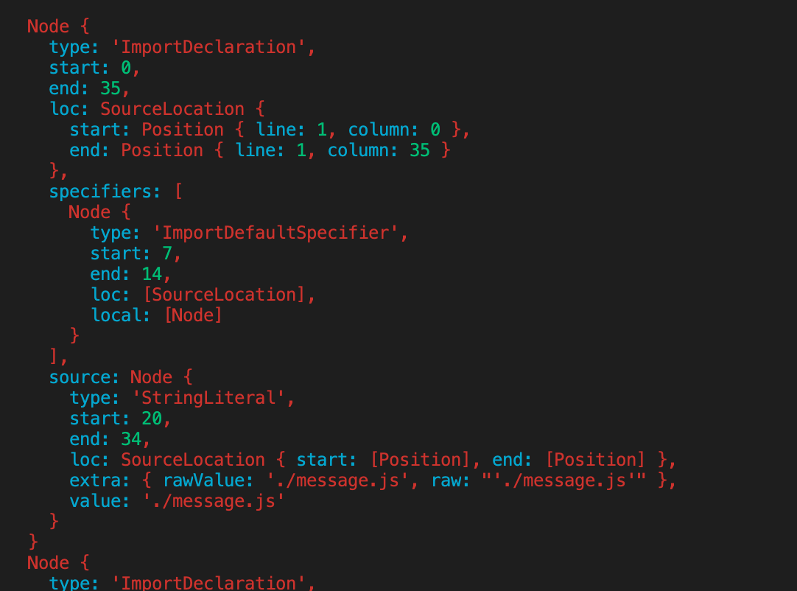

我们可以看到 `node.source.value` 的值就是引入的文件的地址，于是我们就可以进行遍历，我们希望得到每一个引用申明都是一个对象，**键**是引入的值，即 `node.source.value` ，**值**是其相对于项目 `src` 的地址，为了帮助我们之后的打包分析，我们新建一个 `dependencies` 存放申明对象的 **键值对**。

```javascript
const fs = require('fs');
const path = require('path');
const parser = require('@babel/parser');
const traverse = require('@babel/traverse').default;

const moduleAnalyser = (filename) => {
  const content = fs.readFileSync(filename, 'utf-8');
  const ast = parser.parse(content, {
    sourceType: 'module'
  });
  const dependencies = {};
  traverse(ast, {
    ImportDeclaration({ node }) {
      const dirname = path.dirname(filename);
      const newFile = './' + path.join(dirname, node.source.value);
      dependencies[node.source.value] = newFile;
    }
  });
  console.log('---dependencies-\n', dependencies);
}

moduleAnalyser('./src/index.js')
```

我们使用 `node` 模块的 `path` 模块将应用文件相对项目 `src` 文件夹的地址拼出来了，重新打包可以得到下图：


&nbsp;

#### 编译 `es6` 代码

因为我们的代码是 `es6` 的代码，他在浏览器中肯定不能执行，所以我们需要打包编译一下代码，将其转化为浏览器能运行的代码。

这里我们可以借助 `babel` 的核心模版 `@babel/core` 帮我们来编译我们的代码，安装依赖：

```javascript
npm install @babel/core @babel/preset-env -D 
```

接着修改 `moduleAnalyser` 函数，使用我们的 [`@babel/core`](https://www.babeljs.cn/docs/babel-core) 这个模块，`babel` 有一个方法 `transformFromAst` 能帮 `AST` 转化为浏览器能运行的代码：

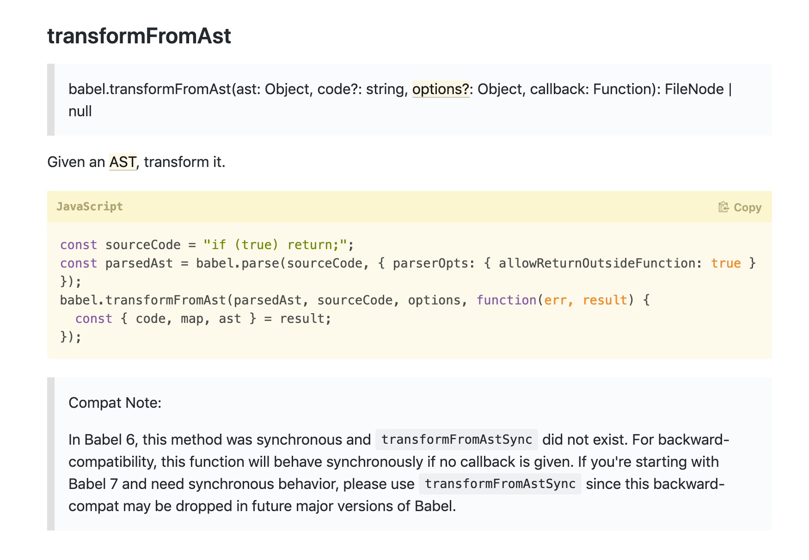

在转化过程中我们需要使用一个 `preset`，叫做 [`@babel/preset-env`](https://www.babeljs.cn/docs/babel-preset-env)，帮助我们解析转化我们的代码：

```javascript
const fs = require('fs');
const path = require('path');
const parser = require('@babel/parser');
const traverse = require('@babel/traverse').default;

const moduleAnalyser = (filename) => {
  const content = fs.readFileSync(filename, 'utf-8');
  const ast = parser.parse(content, {
    sourceType: 'module'
  });
  const dependencies = {};
  traverse(ast, {
    ImportDeclaration({ node }) {
      const dirname = path.dirname(filename);
      const newFile = './' + path.join(dirname, node.source.value);
      dependencies[node.source.value] = newFile;
    }
  });
  const { code } = babel.transformFromAst(ast, null, {
    presets: ["@babel/preset-env"]
  });
  console.log('---code---', code);
}

moduleAnalyser('./src/index.js')
```

我们重新打包一下，可以看到编译好的代码 `code` 如下图所示：


#### 导出

最后我们将分析的文件名、依赖、编译好的代码导出去就完成了：

```javascript
const fs = require('fs');
const path = require('path');
const parser = require('@babel/parser');
const traverse = require('@babel/traverse').default;

const moduleAnalyser = (filename) => {
  const content = fs.readFileSync(filename, 'utf-8');
  const ast = parser.parse(content, {
    sourceType: 'module'
  });
  const dependencies = {};
  traverse(ast, {
    ImportDeclaration({ node }) {
      const dirname = path.dirname(filename);
      const newFile = './' + path.join(dirname, node.source.value);
      dependencies[node.source.value] = newFile;
    }
  });
  const { code } = babel.transformFromAst(ast, null, {
    presets: ["@babel/preset-env"]
  });
  return {
    filename,
    dependencies,
    code
  }
}

const moduleInfo = moduleAnalyser('./src/index.js')
```

重新打包一下，我们可以看到打印一下入口文件分析的结果如下图：


&nbsp;

### 依赖图谱

英文名 `Dependencies Graph`，即从入口文件开始，对所有应用到的文件做分析，最后把所有文件的依赖信息都给分析出来。

我们新建一个函数 `makeDependenciesGraph`，我们通过这个函数来得到 **从项目入口文件开始中所有文件的依赖关系**，我们修改一下 `bundle.js`：

```javascript
...

const makeDependenciesGraph = (entry) => {
  const entryModule = moduleAnalyser(entry);
  console.log('entryModule\n', entryModule);
}

const graphInfo = makeDependenciesGraph('./src/index.js');
```

我们打包一下，可以看到打印出了 `index.js` 的文件依赖信息：


接着我们需要做一个递归遍历，将所有的依赖到文件都去走一下 `moduleAnalyser` 这个方法，取出依赖文件的依赖信息，反复进行这步操作，直到我们的依赖被分析完成为止：

```javascript
...

const makeDependenciesGraph = (entry) => {
  const entryModule = moduleAnalyser(entry);
  const graphArray = [ entryModule ];
  
  for(let i = 0; i < graphArray.length; i++) {
    const item = graphArray[i];
    const { dependencies } = item;
    if(dependencies) {
      for(let j in dependencies) {
        graphArray.push(
          moduleAnalyser(dependencies[j])
        );
      }
    }
  }
  console.log('graphArray\n', graphArray);
}

const graphInfo = makeDependenciesGraph('./src/index.js');
```

我们将入口文件的依赖信息放入 `graphArray` 数组中，接着便对其做一个循环，循环里面的依赖关系，如果有依赖关系，在进行一次 `moduleAnalyser` 的处理，并将处理的结果塞到  `graphArray` 中去，以此类推，我们最终便能得到项目文件所有的依赖关系，我们可以看到得到的结果如下图所示：

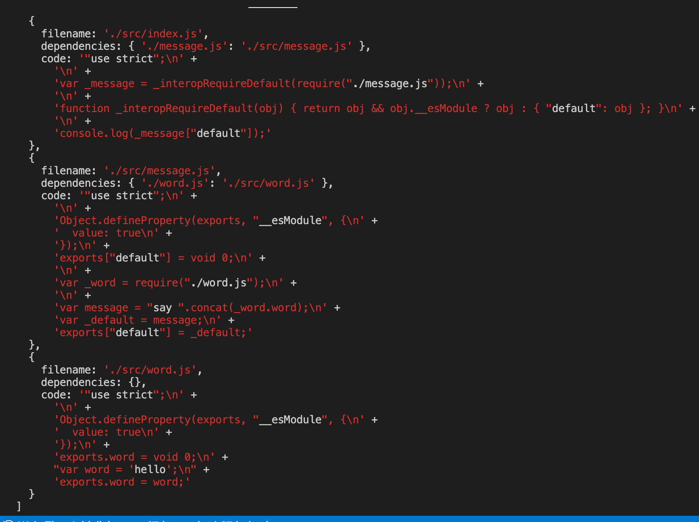

首先我们会分析 `index.js` 文件下的依赖关系，我们发现其引用了 `message.js`，接着我们便对 `message.js` 做 `moduleAnalyser` 操作，发现其依赖了 `word.js`，接着我们会在对 `word.js` 做 `moduleAnalyser` 操作，最后发现 `word.js` 没有任何依赖了，于是循环结束了。

我们在修改一下依赖图谱的展示，最好也想依赖关系的展示一样，以对象的形式进行存放，**键为文件地址，值为此文件的依赖关系和对应编译好的代码**，我们修改一下 `makeDependenciesGraph` 函数：

```javascript
...

const makeDependenciesGraph = (entry) => {
  const entryModule = moduleAnalyser(entry);
  const graphArray = [ entryModule ];
  
  for(let i = 0; i < graphArray.length; i++) {
    const item = graphArray[i];
    const { dependencies } = item;
    if(dependencies) {
      for(let j in dependencies) {
        graphArray.push(
          moduleAnalyser(dependencies[j])
        );
      }
    }
  }
  const graph = {};
  graphArray.forEach(item => {
    graph[item.filename] = {
      dependencies: item.dependencies,
      code: item.code
    }
  });
  console.log('---graph---\n', graph);
}

const graphInfo = makeDependenciesGraph('./src/index.js');
```

我们循环遍历 `graphArray` 将其放到对应的 `graph` 中，我们重新打包一下，可以看到如图所示：


&nbsp;

#### 导出

最后我们将结果导出：

```javascript
...

const makeDependenciesGraph = (entry) => {
  const entryModule = moduleAnalyser(entry);
  const graphArray = [ entryModule ];
  
  for(let i = 0; i < graphArray.length; i++) {
    const item = graphArray[i];
    const { dependencies } = item;
    if(dependencies) {
      for(let j in dependencies) {
        graphArray.push(
          moduleAnalyser(dependencies[j])
        );
      }
    }
  }
  const graph = {};
  graphArray.forEach(item => {
    graph[item.filename] = {
      dependencies: item.dependencies,
      code: item.code
    }
  });
  return graph;
}

const graphInfo = makeDependenciesGraph('./src/index.js');
console.log('---graphInfo---\n', graphInfo);
```

我们打印一下 `graphInfo`，可以得到如下结果：


&nbsp;

### 生成代码

接下来我们要做的就是通过 **依赖图谱** 来生成对应的代码了。

我们新建一个函数 `generateCode`，我们通过这个函数来得到生成代码，我们修改一下 `bundle.js`：

```javascript
...
const generateCode = (entry) => {
  const graph = JSON.stringify(makeDependenciesGraph(entry));
  console.log('---graph--\n', graph);
}

const code = generateCode('./src/index.js');
```

我们打包一下，可以看到打印出了依赖图谱的信息：


接着我们就要去生成代码了，首先代码肯定是一段字符串，而在浏览器上运行代码需要已闭包的形式注入，这样可以避免污染全局变量，我们闭包代码中传入 `graph` 信息，于是可以写出这样的代码：

```javascript
...
const generateCode = (entry) => {
  const graph = JSON.stringify(makeDependenciesGraph(entry));
  return `
    (function(graph){
    })(${graph})
  `;

  console.log('---graph--\n', graph);
}

const code = generateCode('./src/index.js');
console.log(code)
```

我们打包一下，会发现传入的 `graph` 参数是 `[object Object]`：


因为 `graph` 本身是一个对象，他会被转换成 `[object Object]` 这样的一个字符串，所以我们要将 `graph` 进行一次 `JSON.stringify()`，将其转化为字符串：

```javascript
...
const generateCode = (entry) => {
  const graph = JSON.stringify(makeDependenciesGraph(entry));
  ... 
}

const code = generateCode('./src/index.js');
console.log(code)
```

这个时候我们可以看到 `graph` 被正确传入了：


在编写闭包代码之前，我们首先看一下依赖图谱中编译后的代码长什么样子：

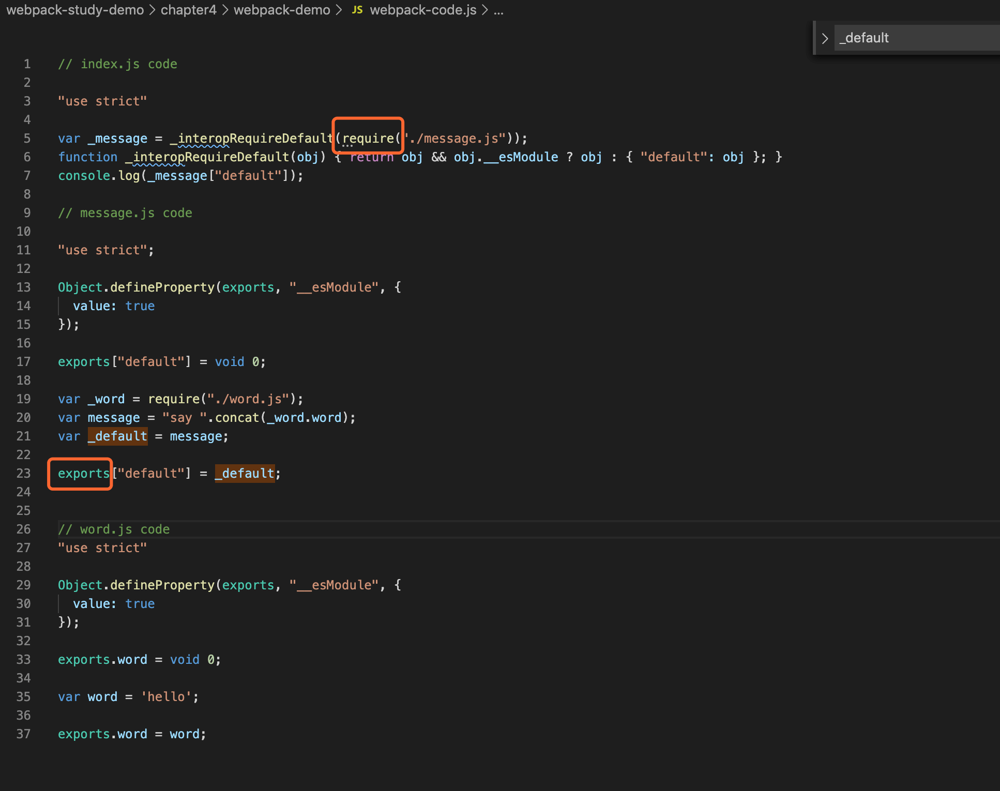

我们可以看到在这些函数中有一个 `require` 这个方法，和 `exports` 这个对象，但实际上在浏览器中是没有 `require` 这个方法 和 `exports` 这个函数的，所以我们需要自定义一个`requier` 这个方法 和 `epxorts` 这个对象，我们可以编写如下代码： 

```javascript
...
const generateCode = (entry) => {
  const graph = JSON.stringify(makeDependenciesGraph(entry));
  return `
    (function(graph){
      function require(module) {
        (function(code){
          eval(code)
        })(graph[module].code);
      };
      require('${entry}')
    })(${graph});
  `;
}

const code = generateCode('./src/index.js');
console.log(code)
```

上面的代码中我们构建了一个 `require` 函数，并且调用一次将 `entry` 入口传进去，在 `require` 中我们还是以一个闭包的形式去写代码，将入口文件对应的 `code` 以参数的形式传进去，最后我们用 `eval` 函数来执行代码。

我们在回过头来看看 `index.js` 编译后的代码：


我们可以看到其中还会执行 `require()` 这个函数，并将 `"./message.js"` 这个文件引入，但是我们发现其实我们需要依赖图谱的 `key` 值需要一个以 `src` 为基准的地址，所以我们需要对路径做一个转化，将 `"./message.js"` 转化为类似 `./src/message.js` 这个地址之后，我们才能在依赖图谱中找到其对应的源代码，所以我们在修改一下代码：

```javascript
...
const generateCode = (entry) => {
  const graph = JSON.stringify(makeDependenciesGraph(entry));
  return `
    (function(graph){
      function require(module) {
        function localRequire(relativePath) {
          return require(graph[module].dependencies[relativePath]);
        }
        
        (function(require, code){
          eval(code)
        })(localRequire, graph[module].code);
      };
      require('${entry}')
    })(${graph});
  `;
}

const code = generateCode('./src/index.js');
console.log(code)
```

我们新建一个 `localRequire` 用来转化文件的路径，并作为参数传给 `require` 中执行的闭包函数，其实在闭包函数中执行的 `require` 函数，是我们经过路径转换过的 `localRequire` 函数，这样就能把依赖图谱对应的编译后的代码都执行一遍了。

接下来我们在回过头来看一下 `exports` 这个对象，我们先看一下下图：

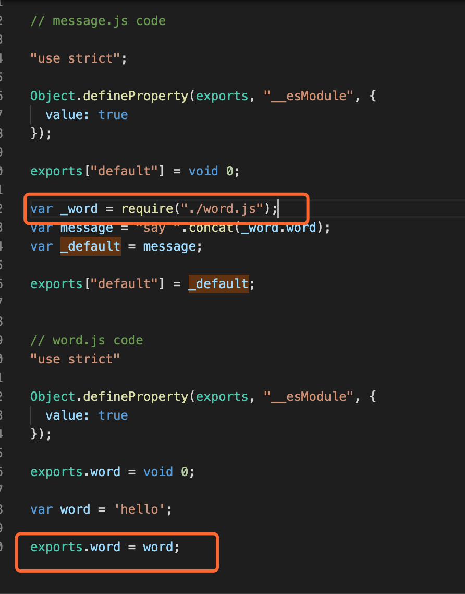

在 `word.js` 中通过 `exports` 导出的 `word` 会在 `message.js` 中会被 `require` 应用，并通过 `_word.word` 的形式进行调用，所以我们可以先申明一个 `exports` 对象，用于存放每一个模块中在 `exports` 中存放的内容：

```javascript
...
const generateCode = (entry) => {
  const graph = JSON.stringify(makeDependenciesGraph(entry));
  return `
    (function(graph){
      function require(module) {
        function localRequire(relativePath) {
          return require(graph[module].dependencies[relativePath]);
        }
        var exports = {};
        (function(require, exports, code){
          eval(code)
        })(localRequire, exports, graph[module].code);
        return exports;
      };
      require('${entry}')
    })(${graph});
  `;
}

const code = generateCode('./src/index.js');
console.log(code)
```

在上述代码中我们在 `require` 外层申明一个 `exports` 对象，在闭包函数中以参数的形式传进去，在代码执行过程中，模块代码可以拿到 `exports` 这个对象，于是便能通过这个对象向外导出一些内容，在最后我们将 `exports` 这个模块进行导出，这样下一个模块在引用这个模块的时候，就能够使用 `exports` 中的一些内容了。

我们可以打印出对应的 `module` 和 `exports`：

```javascript
...
const generateCode = (entry) => {
  const graph = JSON.stringify(makeDependenciesGraph(entry));
  return `
    (function(graph){
      function require(module) {
        function localRequire(relativePath) {
          return require(graph[module].dependencies[relativePath]);
        }
        var exports = {};
        (function(require, exports, code){
          eval(code)
        })(localRequire, exports, graph[module].code);
        console.log('---module---', module);
        console.log('---exports---', exports);
        return exports;
      };
      require('${entry}')
    })(${graph});
  `;
}

const code = generateCode('./src/index.js');
console.log(code)
```

我们打包一下，将打包出来的代码放到浏览器中执行：


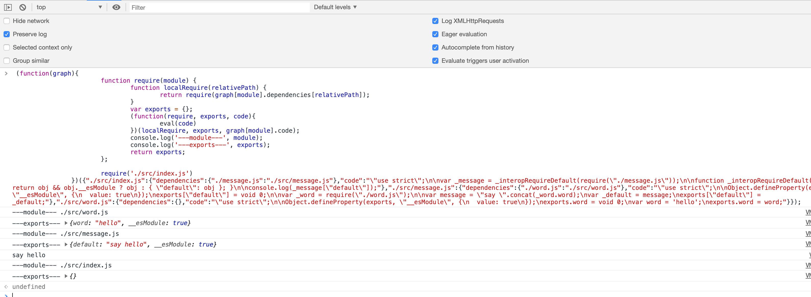

我们可以看到页面中打印出了 `say world`，以及每一个 `module` 对应的 `exports` 的值。

&nbsp;

## 总结

到此我们便完成了一个简单的 `webpack` 的编写，虽然说是一个简单的例子，但是从中也涉及到蛮多的知识点的，我们也能从中对 `webpack` 的打包流程有一定的了解。

&nbsp;

## 相关链接

- [官方叫你手写 webpack](https://webpack.js.org/api/compiler-hooks/)
- [module 和 exports 的实现](https://www.jianshu.com/p/011f2a90291d)
- [require时，exports和module.exports的区别你真的懂吗？](http://www.imooc.com/article/291145)
- [Node.js 模块(module)](http://nodejs.cn/api/modules.html#modules_modules)
- [AST抽象语法树——最基础的javascript重点知识，99%的人根本不了解](https://segmentfault.com/a/1190000016231512)
- [AST Parser](https://esprima.org/demo/parse.html)

&nbsp;

## 示例代码

示例代码可以看这里：

- [第一种方式  示例代码](https://github.com/darrell0904/webpack-study-demo/tree/master/chapter4/class-webpack-demo)
- [第二种方式  示例代码](https://github.com/darrell0904/webpack-study-demo/tree/master/chapter4/webpack-demo)

