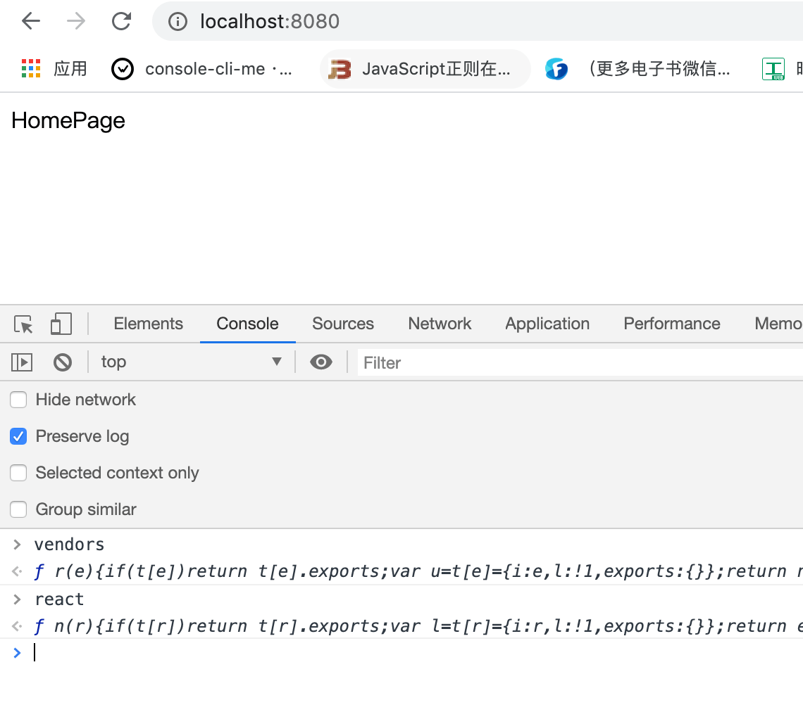
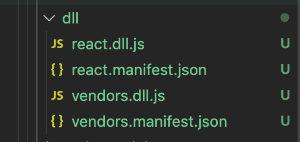
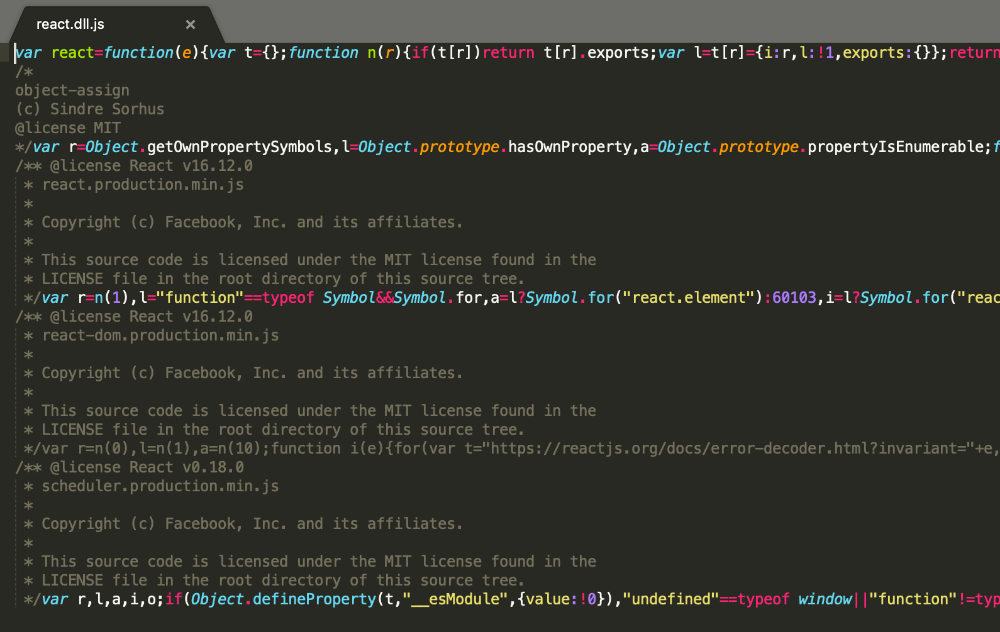
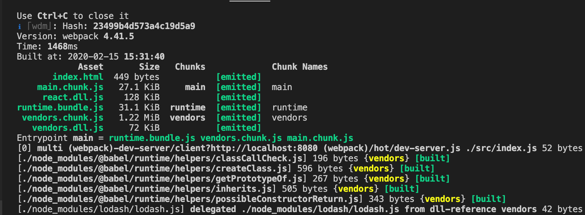

# 使用 `DllPlugin` 提高打包速度

### 添加配置文件

我们在配置文件目录 `config` 下新建一个 `webpack.dll.js`，此文件用于将我们的第三方包文件打包到 `dll` 文件夹中去：

```javascript
const path = require('path');
const webpack = require('webpack');

module.exports = {
  mode: 'production', // 环境
  entry: {
    vendors: ['lodash'], // 将 lodash 打包到 vendors.js 下
    react: ['react', 'react-dom'], // 将 react 和 react-dom 打包到 react.js 下
  },
  output: {
    filename: '[name].dll.js', // 输出的名字
    path: path.resolve(__dirname, '../dll'), // 输出的文件目录
    library: '[name]' // 将我们打包出来的文件以全部变量的形式暴露，可以在浏览器变量的名字进行访问
  },
  plugins: [
    // 对生成的库文件进行分析，生成库文件与业务文件的映射关系，将结果放在 mainfest.json 文件中
    new webpack.DllPlugin({
      name: '[name]', // 和上面的 library 输出的名字要相同
      path: path.resolve(__dirname, '../dll/[name].manifest.json'),
    })
  ]
}
```

- 上面的 `library` 的意思其实就是将 `dll` 文件以一个全局变量的形式导出出去，便于接下来引用，如下图：



- `mainfest.json` 文件是一个映射关系，它的作用就是帮助 `webpack` 使用我们之前打包好的 `***.dll.js` 文件，而不是重新再去 `node_modules` 中去寻找。


接着我们在 `package.json` 的 `scripts` 下在增加一个命令：

```json
"scripts": {
  ...
  "build:dll": "webpack --config ./config/webpack.dll.js",
  ...
},
```

我们在命令行中打包一下 `dll` 文件 `npm run build:dll` 目录，我们可以看到根目录生成了一个 `dll` 文件夹，并且在下面生成了相应的文件，并且 `loader` 打包到了 `vendor.dll.js` 中，`react` 和 `react-dom` 打包到了 `react.dll.js` 中了：







接着我们需要去修改公共配置文件 `webpack.common.js`，将我们之前生成的 `dll` 文件导入到 `html` 中去，如果我们不想自己手动向 `html` 文件去添加 `dll` 文件的时候，我们可以借助一个插件 `add-asset-html-webpack-plugin`，此插件顾名思义，就是将一些文件加到 `html` 中去。

同时我们可以是使用 `webpack` 自带的 `DllReferencePlugin` 文件对 `mainfest.json` 映射文件进行分析。

我们安装一下：

```
npm install add-asset-html-webpack-plugin -D
```

使用此插件：

```javascript
const webpack = require('webpack');
const AddAssetHtmlWebpackPlugin = require('add-asset-html-webpack-plugin');

...

const commonConfig = {
  ...
  plugins: [
    ...
    new AddAssetHtmlWebpackPlugin({
      filepath: path.resolve(__dirname, '../dll/vendors.dll.js')
    }),
    new AddAssetHtmlWebpackPlugin({
      filepath: path.resolve(__dirname, '../dll/react.dll.js')
    }),
    new webpack.DllReferencePlugin({
      manifest: require(path.resolve(__dirname, '../dll/vendors.dll.mainfest.json'))
    }),
    new webpack.DllReferencePlugin({
      manifest: require(path.resolve(__dirname, '../dll/react.dll.mainfest.json'))
    }),
  ],
  ...
}

...
```

我们进行一次打包，可以看到打包耗时为 `1450ms` 左右，同时可以看到库文件打包到的 `vendors.chunk.js` 为 `1.22MB`。



我们注释掉对 `dll` 的引用分析之后，重新打包，打包耗时为 `1950ms` 左右，同时可以看到 `vendors.chunk.js` 为 `5.28MB`。


因此我们可以看到 `dll` 对的打包的速度提升还是很明显的。

&nbsp;

### 一些优化

当我们在 `webpack.dll.js` 中在增加了一个入口文件 `jquery` 文件，我们就需要在在 `webpack.common.js` 在引入两个插件：

```javascript
...
new webpack.DllReferencePlugin({
  manifest: path.resolve(__dirname, '../dll/jquery.dll.js')
}),
  new webpack.DllReferencePlugin({
  manifest: path.resolve(__dirname, '../dll/jquery.dll.mainfest.json')
}),
...
```

这样就很麻烦，所以我们可以写一个方法自动去分析入口，帮我们引入这个入口生成的 `dll` 文件所需的 `plugins`，我们可以修改 `webpack.common.js`，我们定义一个数组变量 `plugins`，并将只用到一次的插件挪进去，接着通过 `node` 的 `fs` 模块去遍历 `dll` 目录下面的文件，并进行引入。

```javascript
...
const fs = require('fs');
...

const plugins = [
  new CleanWebpackPlugin(),
  new HtmlWebpackPlugin({
    template: 'src/index.html',
  }),
  new BundleAnalyzerPlugin({
    analyzerHost: '127.0.0.1',
    analyzerPort: 8889,
    openAnalyzer: false,
  }),
];

const files = fs.readdirSync(path.resolve(__dirname, '../dll'));

files.forEach(file => {
  if(/.*\.dll.js/.test(file)) {
    plugins.push(new AddAssetHtmlWebpackPlugin({
      filepath: path.resolve(__dirname, '../dll', file)
    }))
  }
  if(/.*\.manifest.json/.test(file)) {
    plugins.push(new webpack.DllReferencePlugin({
      manifest: require(path.resolve(__dirname, '../dll', file))
    }))
  }
})

...

const commonConfig = {
  ...
  plugins,
  ...
}
...
```

这样当我们无论在新加几个变量，就都不需要重复的再去手动去引入了。

回顾一下，当 `webpack` 打包引入第三方模块的时候，每一次引入，它都会去从 `node_modules` 中去分析，这样肯定会影响 `webpack` 打包的一些性能，如果我们能在第一次打包的时候就生成一个第三方打包文件，在接下去的过程中应用第三方文件的时候，就直接使用这个文件，这样就会提高 `webpack` 的打包速度。这就是 `DllPlugin` 的作用。