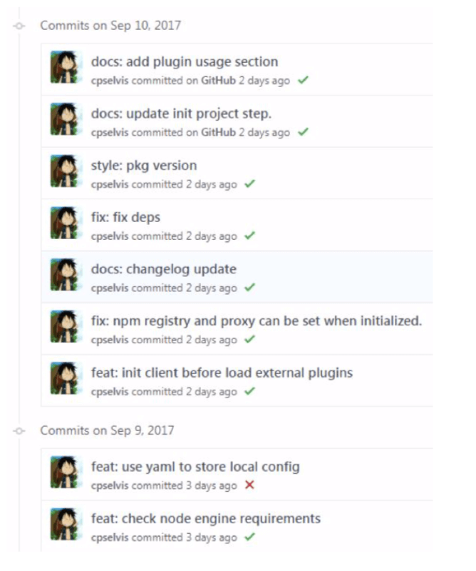

# git 与 语义化规范

## `Git commit` 规范

### 作用

* 能加快 `Code Review` 的流程
* 根据 `Git Commit` 的元数据生成 `Changelog`
* 后续维护者可以知道 `Feature` 被修改的原因

&nbsp;

### 技术方案


其实社区有多种 `Commit message` 的写法规范，我们这里使用 [`Angular`](https://docs.google.com/document/d/1QrDFcIiPjSLDn3EL15IJygNPiHORgU1_OOAqWjiDU5Y/edit#heading=h.greljkmo14y0) 规范，这是目前使用最广的写法。如下图所示：



&nbsp;

### 提交的格式要求

一般提交格式的要求如下图：


#### `type`

`type` 代表了某次提交的类型，比如是修复一个 `bug` 还是增加了一个新的 `feature`。所有的`type` 类型如下：

* `feat`：新增 `feature`
* `fix`：修复 `bug`
* `docs`：仅仅修改了文档，比如 `README`、`CHANGLELOG` 等等
* `style`：仅仅修改了空格、格式缩进、多行等等，不改变逻辑
* `refactor`：代码重构，没有加新的功能或者修复 `bug`
* `perf`：优化相关，比如提升性能、体验等
* `test`：测试用例，包括单元测试、集成测试等
* `chore`：改变构建流程，或者增加依赖库、工具等
* `revert`：回滚到上一个版本

#### `Scope`

`scope` 字段用于说明本次 `commit` 所影响的范围，比如视图层、数据模型或者路由模块等，是一个可选参数。

#### `subject`

`subject` 字段是本次 `commit` 的一个概要，需要用最简洁的语言来说明本次修改的内容。

#### `Body`

可以使用多行文本详细地说明本次提交所改动的一些细节，从而帮助后续的使用者们更好地了解代码的内容。

```bash
More detailed explanatory text, if necessary.  Wrap it to 
about 72 characters or so. 

Further paragraphs come after blank lines.

- Bullet points are okay, too
- Use a hanging indent
```

> 案例取自 阮一峰老师的 [Commit message 和 Change log 编写指南](http://www.ruanyifeng.com/blog/2016/01/commit_message_change_log.html)

#### `Footer`

`Footer` 部分只用于两种情况。

* 不兼容变动

如果本次的 `commit` 与前一个版本的代码无法兼容，那么 `Footer` 部分需要以 `BREAKING CHANGE` 开头，后面描述本次变动的详细情况以及迁移到新版本代码的方法。

```bash
BREAKING CHANGE: isolate scope bindings definition has changed.

    To migrate the code follow the example below:

    Before:

    scope: {
      myAttr: 'attribute',
    }

    After:

    scope: {
      myAttr: '@',
    }

    The removed `inject` wasn't generaly useful for directives so there should be no code using it.
```

> 案例取自 阮一峰老师的 [Commit message 和 Change log 编写指南](http://www.ruanyifeng.com/blog/2016/01/commit_message_change_log.html)

* 关闭 `Issue`

如果当前 `commit` 针对某个 `issue`，那么可以在 `Footer` 部分关闭这个 `issue` 。以 `Close` 开头，后面用 `#` 号标识对应的 `Issue` 号码。

```shell
Closes #123, #245, #992
```

&nbsp;

### `validate-commit-msg`

我们使用 `validate-commit-msg` 在提交之前验证 `commit` 信息是否符合要求。同时我们使用 `husky` 来为本地开发阶段增加 `precommit` 钩子

#### 安装

```shell
npm install validate-commit-msg husky -D
```

#### 配置

我们在 `packages.json` 中新增下面几行代码：

```json
// ...
"husky": {
  "hooks": {
    "commit-msg": "validate-commit-msg"
  }
},
// ...
```

现在当我们在命令行以 `git commit -m '添加代码一波'` 这样的 `commit` 形式提交代码的时候，就会通不过：


`sourceTree`

如果你使用的 `sourceTree` 作为 `git` 的提交工具，你可能会发现


初次之外，我们其实还可以使用 [`commitlint`](https://github.com/conventional-changelog/commitlint) 来帮我们验证 `commit` 是否规范，笔者在这里就不细讲了。


&nbsp;

## 相关链接

- [Commit message 和 Change log 编写指南](http://www.ruanyifeng.com/blog/2016/01/commit_message_change_log.html)
- [git commit 规范指南](https://segmentfault.com/a/1190000009048911)
- [ghoos](https://www.npmjs.com/package/ghooks)

&nbsp;

## 示例代码

示例代码可以看这里：

- [编写可维护的 Webpack 构建配置 示例代码](https://github.com/darrell0904/webpack-study-demo/tree/master/chapter7/webpack-setting-demo)


