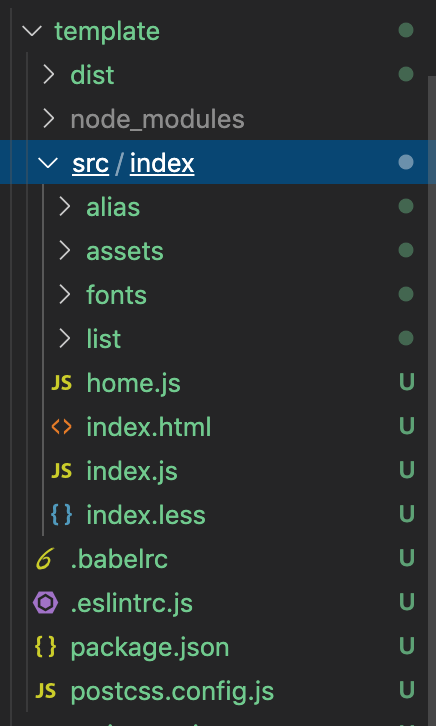
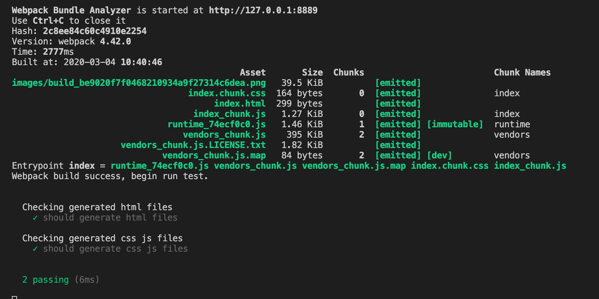
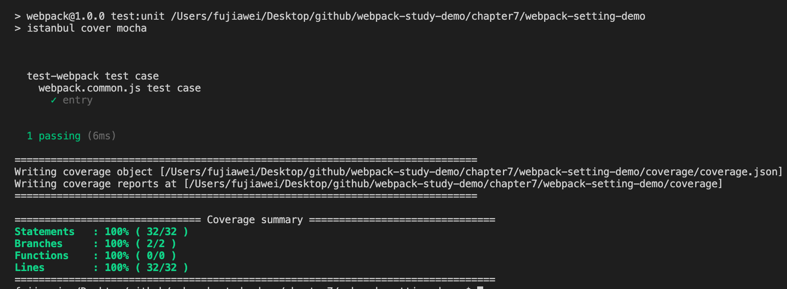

# 构建包测试

## 冒烟测试（`smoke testing`）

**冒烟测试** 最初源于硬件行业，在对一个硬件或者硬件组件进行更改或修复后，先不进行直接测试，而是直接给硬件加电，观察设备是否冒烟。而在软件测试中则是对每一个新编译的需要正式测试的新版本进行一些基本功能的测试，如果测试通过，则可以交付给测试人员进行正式测试，如若不通过则打回交予开发人员进行重新修改。

我们可以在对构建配置进行 **冒烟测试**，这样能提前暴露出能导致令软件基本功能失效的严重问题。


### 执行步骤

#### 判断构建是否成功

首先我们需要判断构建是否有报错，如若出错就是构建失败，则测试不通过。

在这里我们使用 [`mocha`](https://github.com/mochajs/mocha) 来测试我们的构建配置，在 `test` 目录下面新建 `smoke` 文件夹，用来放置相关的测试代码。

##### 测试项目目录

同时为了测试配置文件，我们需要在 `smoke` 新建一个 `template` 文件夹，在此文件夹下放我们的测试项目，就跟我们之前的所有类似示例项目一样，借此项目可以来测试我们的配置文件是否正确。

具体目录如下，笔者就不细讲了：



&nbsp;

##### 例子

我们以 `webpack.prod.js` 作为例子，我们在 `smoke` 文件夹下新建一个 `index.js` 文件，不过需要先安装下依赖：

```shell
npm install rimraf glob-all mocha -D
```

`index.js` 文件的内容如下：

```javascript
const path = require('path');
const webpack = require('webpack');
// 删除文件夹的包
const rimraf = require('rimraf');

// 将路径定位到 `template` 目录
// 因为要删除的是 `template` 下面的 dist 目录
// 当前运行的目录是 `smoke` 根目录
process.chdir(path.join(__dirname, 'template'));

// 删除 dist 目录
rimraf('./dist', () => {
  // 引用 webpack.prod.js 文件
  const prodConfig = require('../../lib/webpack.prod.js');
  
  // 使用 Node 中的方式，编译 webpack
  webpack(prodConfig, (err, stats) => {
    // 观察是否有报错
    if (err) {
      console.error(err);
      process.exit(2);
    }
    // 输出打包过程的描述信息
    console.log(stats.toString({
      colors: true,
      modules: false,
      children: false
    }));
		// webpack 打包成功
    console.log('Webpack build success, begin run test.');
  });
});
```

具体的注释我在上面的代码中都有描述，主要需要注意两个点：

* 通过 `process.chdir(path.join(__dirname, 'template'))` 进入到相应的目录，进行相应的操作
* 通过 `Webpack` 在 `Node` 中的 `Api`，即传入一个配置文件，和回调函数，执行 `Webpack` 编译。

&nbsp;

#### 判断基本功能是否正常

当构建成功之后，其次我们还需要判断每次构建后，打包生成的 `build` 目录是否会有内容输出来，比如

* 是否有 `js`、`css` 等静态资源文件
* 是否有 `HTML` 文件

##### 测试用例

我们可以通过 `mocha` 来编写几个测试用例，在 `test` 目录下新建 `html-test.js` 和 `css-js-test.js`，分别用来测试是否产生 `HTML` 和 `js`、`css` 等静态文件。

对于测试用例的用法笔者在这里就不细讲了，就讲两个简单的概念：

* `describe`

称为"测试套件"（`test suite`），表示一组相关的测试。它是一个函数，第一个参数是测试套件的名称（"加法函数的测试"），第二个参数是一个实际执行的函数。

* `it`

称为"测试用例"（`test case`），表示一个单独的测试，是测试的最小单位。它也是一个函数，第一个参数是测试用例的名称（"1 加 1 应该等于 2"），第二个参数是一个实际执行的函数。


`html-test.js`

```javascript
const glob = require('glob-all');

describe('Checking generated html files', () => {
  it('should generate html files', (done) => {
    const files = glob.sync([
      './dist/index.html'
    ]);
    
    if (files.length > 0) {
      done();
    } else {
      throw new Error('no html files generated');
    }
  });
});
```

`css-js-test.js`

```javascript
const glob = require('glob-all');

describe('Checking generated css js files', () => {
  it('should generate css js files', (done) => {
    const files = glob.sync([
      './dist/index_*.js',
      './dist/index_*.css',
    ]);
    
    if (files.length > 0) {
      done();
    } else {
      throw new Error('no css js files generated');
    }
  });
});
```

上面两个是测试用例，通过判断编译生成的 `dist` 目录下有没有生成 `index.html` 以及 `css`、`js` 结尾的文件，通过 `glob-all` 这个库来匹配相应的文件。

##### 引入用例

我们在 `index.js` 中引入相应的测试用例：

```javascript
// ...
const Mocha = require('mocha');

// 引入 mocha，设置延迟时间 10 s
// 必须要等 dist 目录出来之后才能进行测试
// webpack 编译需要时间
const mocha = new Mocha({
    timeout: '10000ms'
});

// ...
rimraf('./dist', () => {
  // ....
  webpack(prodConfig, (err, stats) => {
    // ...
		// webpack 打包成功
    console.log('Webpack build success, begin run test.');
    
    // 引入 html 测试用例
    mocha.addFile(path.join(__dirname, 'html-test.js'));
    // 引入 css-js 测试用例
    mocha.addFile(path.join(__dirname, 'css-js-test.js'));
    // 开始跑测试
    mocha.run();
  });
});
```

这个比较简单，更多的 `mocha` 参数大家可以参考 `mocha` 的文档。


最后我们在 `package.json` 的 `scripts` 中加入一行命令：

```json
"scripts": {
  // ...
  "test:smoke": "node ./test/smoke/index.js",
},
```

接着我们运行 `npm run test:smoke` 命令，可以看到测试通过，具体结果如下：



&nbsp;

## 单元测试

单元测试（`unit testing`），是指对软件中的最小可测试单元进行检查和验证。

也就是对项目中代码的所有功能单元进行测试，可能有的时候代码几个地方是相互影响的，改了这个之后，其他功能就坏了，所以需要单元测试来保证功能的正确性。

### 单元测试

我们在 `test` 目录下新增 `unit` 单元测试文件夹，新建一个 `webpack-common-test.js`，用来测试公共配置文件，同时在 `test` 目录下新建 `index.js` 文件，用来统一引入单元测试的文件，即 `unit` 目录下的所有文件。

我们先简单比较一下 `entry` 路径是不是符合我们的预期：

安装相应的库：

```shell
npm install assert -D
```

修改 `webpack-common-test.js`：

```javascript
// webpack-common-test.js

// 断言库
// mocha 单元测试 搭配使用
// 可以使用 assert.equal 判断是否相等
const assert = require('assert');

describe('webpack.base.js test case', () => {
  const baseConfig = require('../../lib/webpack.common.js')
  
  it('entry', () => {
    assert.equal(baseConfig.entry.index, '/Users/fujiawei/Desktop/github/webpack-study-demo/chapter7/webpack-setting-demo/test/smoke/template/src/index/index.js');
  });
});
```

> 这里我们使用了断言库 [`assert`](https://github.com/browserify/commonjs-assert)，，搭配 `mocha` 一起使用，在这里我们只是简单的判断一下  `entry` 库是不是符合我们的预期，更多功能就不展开了，大家可以自己去编写。
>
> 关于断言库大家还可以使用 [`chai`](https://github.com/chaijs/chai)，具体参数可以参考其文档，笔者在这里也不做介绍了。


### 测试覆盖率

关于测试覆盖率，我们可以使用 [`istanbul`](https://github.com/gotwarlost/istanbul)，它是一个计算测试覆盖率的工具，支持所有 `JS` 覆盖用例，包括单元测试，服务器端功能测试和浏览器测试等。

#### 安装

```shell
npm install istanbul -D
```

#### 配置

我们在 `package.json` 的 `scripts` 中加入一行单元测试命令：

```json
"scripts": {
  // ...
  "test:smoke": "node ./test/smoke/index.js",
  "test:unit": "istanbul cover mocha",
  "test": "npm run test:smoke && npm run test:unit" // 代表同时执行以上两个命令
},
```

我们在 `test` 目录喜爱运行 `npm run test:unit`，可以看到测试覆盖率也被打印了出来：



&nbsp;

## 一些总结

一般来说，如果要发布一个放到工作中或者社区中，被大家所使用的包，我们需要必须做好测试工作，保证我们输出的代码没有什么问题。

测试工具的选择除了 `mocha` 之外，我们还可以使用 `jest`，个人感觉 `jest` 比较好用，不过这个也看大家平时工作中的习惯。

&nbsp;

## 相关链接

- [mocha](https://github.com/mochajs/mocha)
- [jest](https://jestjs.io/)
- [测试框架 Mocha 实例教程](http://www.ruanyifeng.com/blog/2015/12/a-mocha-tutorial-of-examples.html)
- [前端测试框架 Jest](https://juejin.im/post/597aa518f265da3e345f3262)
- [测试框架 Mocha 实例教程](http://www.ruanyifeng.com/blog/2015/12/a-mocha-tutorial-of-examples.html)

&nbsp;

## 示例代码

示例代码可以看这里：

- [编写可维护的 Webpack 构建配置 示例代码](https://github.com/darrell0904/webpack-study-demo/tree/master/chapter7/webpack-setting-demo)